# Execution Plan

## Detailed Analysis Summary

### Project Scope
- **Project Type**: Greenfield with preconfigured stack
- **Product**: SaaS quiniela application for FIFA World Cup 2026, extensible to other football competitions
- **Core Domain**: Predictions, pools, scoring, rankings, competition data synchronization
- **Deployment Target**: Vercel for the Next.js app, Supabase for Auth and PostgreSQL
- **Security Extension**: Security Baseline enabled and blocking
- **PBT Extension**: Disabled

### Change Impact Assessment
- **User-facing changes**: Yes — full consumer-facing SaaS with onboarding, profiles, avatars, pools, predictions, rankings, and admin views
- **Structural changes**: Yes — new domain modules, service boundaries, Supabase Auth integration, Supabase RLS, external API adapter
- **Data model changes**: Yes — new schema for profiles, competitions, teams, matches, pools, pool memberships, predictions, scoring, sync logs, audit data
- **API changes**: Yes — new Server Actions/API endpoints for auth profile management, pools, predictions, ranking, admin operations, and football data sync
- **NFR impact**: Yes — authentication, authorization, security headers, input validation, structured logging, rate limiting, monitoring, and future crypto-readiness

### Risk Assessment
- **Risk Level**: High
- **Rollback Complexity**: Moderate to Difficult
- **Testing Complexity**: Complex
- **Primary Risks**:
  - Prediction lock timing must be server-authoritative to prevent manipulation
  - Scoring logic must be deterministic and auditable
  - Supabase Auth account linking must avoid duplicate users
  - RLS policies must prevent cross-pool and cross-user data leaks
  - External football API data may be delayed, rate-limited, or inconsistent
  - Future USDT/Solana betting requires v1 data to be immutable and audit-friendly

## Workflow Visualization

```mermaid
flowchart TD
    Start(["User Request"])

    subgraph INCEPTION["INCEPTION PHASE"]
        WD["Workspace Detection<br/><b>COMPLETED</b>"]
        RE["Reverse Engineering<br/><b>SKIPPED</b>"]
        RA["Requirements Analysis<br/><b>COMPLETED</b>"]
        US["User Stories<br/><b>COMPLETED</b>"]
        WP["Workflow Planning<br/><b>COMPLETED</b>"]
        AD["Application Design<br/><b>EXECUTE</b>"]
        UG["Units Generation<br/><b>EXECUTE</b>"]
    end

    subgraph CONSTRUCTION["CONSTRUCTION PHASE"]
        FD["Functional Design<br/><b>EXECUTE</b>"]
        NFRA["NFR Requirements<br/><b>EXECUTE</b>"]
        NFRD["NFR Design<br/><b>EXECUTE</b>"]
        ID["Infrastructure Design<br/><b>EXECUTE</b>"]
        CG["Code Generation<br/>(Planning + Generation)<br/><b>EXECUTE</b>"]
        BT["Build and Test<br/><b>EXECUTE</b>"]
    end

    subgraph OPERATIONS["OPERATIONS PHASE"]
        OPS["Operations<br/><b>PLACEHOLDER</b>"]
    end

    Start --> WD
    WD --> RE
    RE --> RA
    RA --> US
    US --> WP
    WP --> AD
    AD --> UG
    UG --> FD
    FD --> NFRA
    NFRA --> NFRD
    NFRD --> ID
    ID --> CG
    CG --> BT
    BT --> OPS
    BT --> End(["Complete"])

    style WD fill:#4CAF50,stroke:#1B5E20,stroke-width:3px,color:#fff
    style RA fill:#4CAF50,stroke:#1B5E20,stroke-width:3px,color:#fff
    style US fill:#4CAF50,stroke:#1B5E20,stroke-width:3px,color:#fff
    style WP fill:#4CAF50,stroke:#1B5E20,stroke-width:3px,color:#fff
    style RE fill:#BDBDBD,stroke:#424242,stroke-width:2px,stroke-dasharray: 5 5,color:#000
    style AD fill:#4CAF50,stroke:#1B5E20,stroke-width:3px,color:#fff
    style UG fill:#4CAF50,stroke:#1B5E20,stroke-width:3px,color:#fff
    style FD fill:#4CAF50,stroke:#1B5E20,stroke-width:3px,color:#fff
    style NFRA fill:#4CAF50,stroke:#1B5E20,stroke-width:3px,color:#fff
    style NFRD fill:#4CAF50,stroke:#1B5E20,stroke-width:3px,color:#fff
    style ID fill:#4CAF50,stroke:#1B5E20,stroke-width:3px,color:#fff
    style CG fill:#4CAF50,stroke:#1B5E20,stroke-width:3px,color:#fff
    style BT fill:#4CAF50,stroke:#1B5E20,stroke-width:3px,color:#fff
    style OPS fill:#4CAF50,stroke:#1B5E20,stroke-width:3px,color:#fff
    style Start fill:#CE93D8,stroke:#6A1B9A,stroke-width:3px,color:#000
    style End fill:#CE93D8,stroke:#6A1B9A,stroke-width:3px,color:#000
    linkStyle default stroke:#333,stroke-width:2px
```

### Text Alternative
1. Workspace Detection: completed
2. Reverse Engineering: skipped because this is a template without business logic
3. Requirements Analysis: completed
4. User Stories: completed
5. Workflow Planning: completed
6. Application Design: completed
7. Units Generation: completed
8. Functional Design: completed per unit
9. NFR Requirements: completed per unit
10. NFR Design: completed per unit
11. Infrastructure Design: completed per unit
12. Code Generation: completed per unit
13. Build and Test: completed
14. Operations: completed

## Phases to Execute

### INCEPTION PHASE
- [x] Workspace Detection — COMPLETED
- [x] Reverse Engineering — SKIPPED
  - **Rationale**: The project is a Next.js template with stack configuration but no existing domain logic.
- [x] Requirements Analysis — COMPLETED
- [x] User Stories — COMPLETED
- [x] Workflow Planning — COMPLETED
- [x] Application Design — COMPLETED
  - **Rationale**: New components and services are required for Supabase Auth, profiles, avatars, competitions, matches, pools, predictions, scoring, rankings, admin operations, and external API sync.
  - **UX Requirement**: Application Design must include screen contracts for the primary user education and product flows before implementation decisions are finalized.
  - **Result**: Application design, components, services, component dependency, component methods, screen contracts, unit-of-work story map, and unit-of-work dependency all documented in `inception/application-design/`.
- [x] Units Generation — COMPLETED
  - **Rationale**: The product must be decomposed into manageable implementation units because it spans auth, domain model, external data integration, scoring algorithms, pool management, admin operations, and security constraints.
  - **Result**: 38 units decomposed in `inception/application-design/unit-of-work.md` with recommended implementation sequence.

### CONSTRUCTION PHASE
- [x] Functional Design — COMPLETED
  - **Rationale**: Complex business logic exists for prediction locking, scoring rules, penalties, pool membership rules, ranking ties, account linking, and future betting auditability.
  - **Result**: All 38 units have Functional Design artifacts (full design for Units 1–7, 10; light design for refine Units 8, 11–38).
- [x] NFR Requirements — COMPLETED
  - **Rationale**: Security Baseline is enabled. The system has auth, RLS, PII, external API integration, serverless deployment, rate limits, and future financial/betting extensibility.
  - **Result**: NFR Requirements documented for Units 1, 2, 4, 10 (full); refined in Units 22, 26, 27, 37 (performance); SKIP for other refine units.
- [x] NFR Design — COMPLETED
  - **Rationale**: NFR patterns must be incorporated into architecture: structured logging, security headers, RLS, rate limiting, audit logs, monitoring, retry strategy, and fail-closed behavior.
  - **Result**: NFR Design patterns documented for Units 1, 2, 4, 10.
- [x] Infrastructure Design — COMPLETED
  - **Rationale**: The deployment target is Vercel + Supabase. Design must define environment variables, Supabase Auth configuration, database/RLS setup, storage buckets for avatars, football-data.org integration, and sync job strategy.
  - **Result**: Infrastructure design documented for Units 1, 2, 4, 10; migrations for Units 15, 17, 24, 26, 27, 37; shared-infrastructure.md captures env vars, connection strings, and Supabase config.
- [x] Code Generation — COMPLETED
  - **Rationale**: Always required for implementation planning and code generation.
  - **Result**: All 38 units implemented. 265/265 tests passing, tsc 0, Biome/ESLint clean, `pnpm build` OK.
- [x] Build and Test — COMPLETED
  - **Rationale**: Always required for build, unit tests, integration tests, and verification instructions.
  - **Result**: Build and test instructions in `construction/build-and-test/`. Suite verified: 265/265 tests, 57 test files, 25 routes.

### OPERATIONS PHASE
- [x] Operations — COMPLETED
  - **Rationale**: Current AI-DLC operations stage is a placeholder; deployment and monitoring design are covered by Infrastructure Design and Build/Test instructions.
  - **Result**: Runbook documentado (`operations/operations-runbook.md`). CF-6 (Prisma migrations), CF-7 (token_hash templates), CF-9 (Secure email change off), CF-10 (Passkey auth ON) all deployed and verified in prod. Smoke visual del app shell, passkey management y sync ejecutados. 146 matches en BD desde football-data.org. Eliminar cuenta verificado en prod. Pendiente: Unit 38 smoke visual + push del commit `ef0551f`.

## Recommended Units of Work

1. **Foundation: Supabase Auth, Profile, Nickname, Avatar**
   - Supabase Auth integration, account linking, email verification, Google OAuth, passkeys/MFA placeholders, profile table, nickname discriminator, avatar sources.
2. **Competition Data Model and External API Sync**
   - Competitions, teams, matches, phases, fixture ingestion, API-Football adapter, admin override fallback.
3. **Pools and Membership**
   - Public/private pools, invite links, join/leave rules, participant limit, pool admin member removal before first match.
4. **Predictions and Match Locking**
   - Match score predictions, knockout penalty winner selection, server-authoritative lock at kickoff, immutable prediction snapshots.
5. **Scoring and Pool Rankings**
   - Deterministic scoring engine, penalty bonus, ranking per pool only, tied winners without tiebreakers.
6. **Admin and Observability**
   - Admin views, sync status, manual result override, structured logs, security event visibility.

## UX/UI Planning Requirement

Application Design must include screen contracts for the following surfaces before Units Generation:

1. **Landing / Public Home**
   - Explain the quiniela concept, why pools matter, and the core scoring rules in under 30 seconds.
2. **Onboarding**
   - Guide first-time users through nickname, avatar, rules, pool join/create, and first prediction.
3. **Rules Center**
   - Provide complete, always-accessible rules for scoring, penalties, pools, match locks, and ranking ties.
4. **Match Prediction Screen**
   - Make the primary action clear: submit or update prediction before kickoff.
   - Show scoring hints and knockout penalty logic contextually.
5. **Pool Detail**
   - Explain pool type, members, limit, admin controls, current ranking, and next actionable matches.
6. **Pool Invite / Join**
   - Clarify public vs private entry, capacity limit, and what joining means.
7. **Leaderboard**
   - Show ranking by pool only, tied winners clearly, and score breakdown.
8. **Profile / Avatar / Nickname**
   - Support Google photo, default avatar set, custom upload, and Discord-style nickname discriminator.
9. **Admin Sync Dashboard**
   - Surface external API sync status, failures, manual override action, and recalculation impact.

These screen contracts must define user goal, entry context, primary action, secondary actions, minimum decision content, empty/loading/error/success states, mobile notes, and UX risks.

## Estimated Timeline
- **Total Remaining AI-DLC Stages**: 0 — All stages completed (2026-06-17).
- **Actual Duration**: 8 days (2026-06-09 to 2026-06-17).
- **Delivery Strategy**: Sequential units 1–7 (greenfield), followed by parallel refine/concurrent units 8–38.
- **Total Units**: 38 implemented and verified. 265 tests, 25 routes, `pnpm build` OK.

## Success Criteria
- Users can register with email or Google and get the correct verification state.
- Users can configure nickname and avatar reliably.
- Users can join multiple public/private pools.
- Users can predict valid matches until kickoff.
- Knockout penalty predictions follow the domain rules.
- Points are calculated deterministically and shown per pool.
- Rankings are scoped to pools only and support tied winners.
- Match data is ingested from an external football API with admin fallback.
- Supabase RLS and application authorization prevent unauthorized reads/writes.
- V1 data model remains compatible with future USDT/Solana betting extensions.

## Security Compliance Summary
- **SECURITY-01**: Applicable — Supabase/PostgreSQL and all external communication must use TLS and encryption at rest.
- **SECURITY-02**: Applicable — Vercel/Supabase/API access logging must be planned.
- **SECURITY-03**: Applicable — structured logging required.
- **SECURITY-04**: Applicable — Next.js/Vercel security headers required.
- **SECURITY-05**: Applicable — all Server Actions/API inputs require schema validation.
- **SECURITY-06**: Applicable — least privilege for Supabase keys and RLS policies.
- **SECURITY-07**: Applicable — deployment/network restrictions through managed platforms.
- **SECURITY-08**: Applicable — app-level auth, ownership checks, and RLS required.
- **SECURITY-09**: Applicable — hardening and safe production error handling required.
- **SECURITY-10**: Applicable — dependency lockfile and scanning required.
- **SECURITY-11**: Applicable — secure design, rate limiting, and misuse cases required.
- **SECURITY-12**: Applicable — Supabase Auth credentials, sessions, optional MFA/passkeys required.
- **SECURITY-13**: Applicable — immutable predictions and audit-friendly changes required.
- **SECURITY-14**: Applicable — security event visibility and retention required.
- **SECURITY-15**: Applicable — fail-closed error handling for API, DB, and auth flows required.
