# Execution Plan — Unit 11: App Shell & Navigation (Refine)

> Refine post-construcción. No reinicia ni invalida las etapas aprobadas de Units 1–10.
> Este plan es **aditivo** y de alcance **UI-only**.

## Intent (raw)

"Falta un navbar o lo que se considere. El usuario, en toda la aplicación, no tiene ningún
indicativo de que la sesión está iniciada: no puede cerrar sesión, no puede cambiar el tema,
no puede entrar a su perfil. No luce como una app que le permita controlar los distintos
aspectos. Lo mismo pasa con el admin. Trabajarlo como un nuevo requerimiento."

## Detailed Analysis Summary

### Estado actual (hallazgos)
- `src/app/layout.tsx` monta `ThemeProvider`, `BrandThemeProvider`, `AuthProvider`, `Toaster` — pero **no hay header/navbar global**.
- `ThemeToggle` y `BrandToggle` existen (`src/components/theme/`) pero **solo se montan en `/` y `/rules`** (superficie pública). En la app autenticada no hay forma de cambiar tema/marca.
- `/matches`, `/pools`, `/rules`, `/settings/*` y `/admin/*` renderizan su propio `<main>` sin chrome compartido: **sin indicador de sesión, sin avatar/nickname, sin logout, sin enlace a perfil, sin navegación primaria**.
- `/admin` y `/admin/matches` no tienen forma visible de volver a la app ni contexto de "estás en admin".

### Piezas reutilizables ya existentes (no se reinventan)
- `signOut()` — `src/features/auth/actions/sign-out.ts` (server action, redirige a `/sign-in`).
- `ThemeToggle` (light/dark/system) y `BrandToggle` (deportivo/moderno/premium).
- `Avatar` — `src/components/ui/avatar.tsx`.
- `getProfile()` / `getDisplayNickname()` y `verificationStatus === "ADMIN"` para el gate del enlace Admin.
- Tokens de marca de Unit 8 (`globals.css`).

### Change Impact Assessment
- **User-facing changes**: Sí — nuevo chrome global (header + menú de usuario) en rutas autenticadas y en admin.
- **Structural changes**: No — sin cambios de arquitectura; se introduce 1 layout de route-group + componentes de presentación.
- **Data model changes**: No.
- **API / Server Actions changes**: No — se consume `signOut()` y `getProfile()` existentes.
- **NFR impact**: Solo accesibilidad (navegación por teclado, `aria-current`, foco, labels) y comportamiento responsive; sin nuevas preocupaciones de performance/seguridad/escalabilidad. El gate de sesión sigue en `src/proxy.ts`.

### Risk Assessment
- **Risk Level**: Low — cambio aditivo, dentro de fronteras de componentes existentes.
- **Rollback Complexity**: Easy — eliminar el layout/los componentes nuevos restaura el estado previo.
- **Testing Complexity**: Simple — tests de componente (menú de usuario, gate admin), a11y y un e2e de visibilidad de sesión/logout/tema.

### Decisiones de alcance asumidas (a confirmar en la aprobación)
1. **Dónde se monta**: un layout de grupo `src/app/(app)/layout.tsx` (o `AppHeader` compartido) que cubra rutas autenticadas: `/matches`, `/pools`, `/rules`, `/settings/*`, `/admin/*`. **No** se monta en el route-group `(auth)` ni en `/onboarding/*` (flujos sin chrome).
2. **Contenido del header**:
   - Marca/logo → enlace a `/matches`.
   - Navegación primaria: Partidos (`/matches`), Ligas (`/pools`), Reglas (`/rules`).
   - Cluster derecho: `BrandToggle` + `ThemeToggle` + **menú de usuario** (avatar + nickname) con: Perfil (`/settings/profile`), Seguridad (`/settings/security`), **Admin** (`/admin`, solo si `verificationStatus === "ADMIN"`), y **Cerrar sesión** (`signOut()`).
3. **Admin**: misma shell + entrada/realce de contexto "Admin" y enlace de regreso a la app; `/admin` y `/admin/matches` mantienen su gate (`notFound()` si no es admin).
4. **Responsive**: en móvil la navegación colapsa en un menú (sheet/dropdown); toggles y menú de usuario accesibles.
5. **Idioma**: copy en español (consistente con la app), vía `@/i18n/dictionaries/es`.

## Workflow Visualization

```mermaid
flowchart TD
    Start(["Refine: App Shell & Navigation"])

    subgraph INCEPTION["INCEPTION PHASE"]
        RA["Requirements Analysis<br/><b>EXECUTE (minimal)</b>"]
        US["User Stories<br/><b>EXECUTE (light)</b>"]
        WP["Workflow Planning<br/><b>IN PROGRESS</b>"]
        AD["Application Design<br/><b>EXECUTE (light)</b>"]
        UG["Units Generation<br/><b>EXECUTE (register Unit 11)</b>"]
    end

    subgraph CONSTRUCTION["CONSTRUCTION PHASE (Unit 11)"]
        FD["Functional Design<br/><b>EXECUTE (light)</b>"]
        NFRA["NFR Requirements<br/><b>SKIP</b>"]
        NFRD["NFR Design<br/><b>SKIP</b>"]
        ID["Infrastructure Design<br/><b>SKIP</b>"]
        CG["Code Generation<br/><b>EXECUTE</b>"]
        BT["Build and Test<br/><b>EXECUTE</b>"]
    end

    subgraph OPERATIONS["OPERATIONS PHASE"]
        OPS["Operations<br/><b>PLACEHOLDER</b>"]
    end

    Start --> RA
    RA --> US
    US --> WP
    WP --> AD
    AD --> UG
    UG --> FD
    FD --> NFRA
    NFRA --> NFRD
    NFRD --> ID
    ID --> CG
    CG --> BT
    BT --> OPS
    OPS --> End(["Complete"])

    style Start fill:#CE93D8,stroke:#6A1B9A,stroke-width:3px,color:#000
    style End fill:#CE93D8,stroke:#6A1B9A,stroke-width:3px,color:#000
    style WP fill:#4CAF50,stroke:#1B5E20,stroke-width:3px,color:#fff
    style CG fill:#4CAF50,stroke:#1B5E20,stroke-width:3px,color:#fff
    style BT fill:#4CAF50,stroke:#1B5E20,stroke-width:3px,color:#fff
    style RA fill:#FFA726,stroke:#E65100,stroke-width:3px,stroke-dasharray: 5 5,color:#000
    style US fill:#FFA726,stroke:#E65100,stroke-width:3px,stroke-dasharray: 5 5,color:#000
    style AD fill:#FFA726,stroke:#E65100,stroke-width:3px,stroke-dasharray: 5 5,color:#000
    style UG fill:#FFA726,stroke:#E65100,stroke-width:3px,stroke-dasharray: 5 5,color:#000
    style FD fill:#FFA726,stroke:#E65100,stroke-width:3px,stroke-dasharray: 5 5,color:#000
    style NFRA fill:#BDBDBD,stroke:#424242,stroke-width:2px,stroke-dasharray: 5 5,color:#000
    style NFRD fill:#BDBDBD,stroke:#424242,stroke-width:2px,stroke-dasharray: 5 5,color:#000
    style ID fill:#BDBDBD,stroke:#424242,stroke-width:2px,stroke-dasharray: 5 5,color:#000
    style OPS fill:#FFF59D,stroke:#F9A825,stroke-width:2px,color:#000

    linkStyle default stroke:#333,stroke-width:2px
```

## Phases to Execute

### INCEPTION PHASE
- [x] Workspace Detection (COMPLETED — brownfield, Units 1–10)
- [x] Reverse Engineering (N/A)
- [ ] Requirements Analysis — **EXECUTE (minimal)**
  - **Rationale**: Registrar FR-SHELL-01 (app shell global) en `requirements.md` sin reabrir requisitos existentes. Petición clara → depth mínima.
- [ ] User Stories — **EXECUTE (light)**
  - **Rationale**: Feature user-facing con varias acciones (ver sesión, cambiar tema, ir a perfil, cerrar sesión, contexto admin). Pocas historias en una nueva épica.
- [x] Workflow Planning — **IN PROGRESS** (este documento)
- [ ] Application Design — **EXECUTE (light)**
  - **Rationale**: Se introduce un componente/route-group nuevo (`AppHeader`/`(app)` layout + menú de usuario). Definir contratos, dónde se monta y matriz de cobertura de rutas.
- [ ] Units Generation — **EXECUTE (register Unit 11)**
  - **Rationale**: Formalizar Unit 11 en el mapa de unidades como refine.

### CONSTRUCTION PHASE (Unit 11)
- [ ] Functional Design — **EXECUTE (light)**
  - **Rationale**: Contratos de componentes, matriz de rutas con/sin shell, estados (autenticado vs admin), comportamiento móvil y criterios de accesibilidad.
- [ ] NFR Requirements — **SKIP**
  - **Rationale**: Sin nuevos requisitos de performance/seguridad/escalabilidad; reutiliza auth gate existente. La a11y se trata en Functional Design.
- [ ] NFR Design — **SKIP**
  - **Rationale**: NFR Requirements omitido.
- [ ] Infrastructure Design — **SKIP**
  - **Rationale**: Sin cambios de infraestructura/despliegue.
- [ ] Code Generation — **EXECUTE (ALWAYS)**
  - **Rationale**: Implementar layout `(app)`, `AppHeader`, menú de usuario, montar toggles, integrar `signOut()`; cubrir admin.
- [ ] Build and Test — **EXECUTE (ALWAYS)**
  - **Rationale**: Tipos, lint, tests de componente + a11y, e2e de sesión/logout/tema, build.

### OPERATIONS PHASE
- [ ] Operations — PLACEHOLDER

## Success Criteria
- **Primary Goal**: En toda ruta autenticada (incluido admin), el usuario ve que su sesión está iniciada y puede: cambiar tema/marca, abrir su perfil/seguridad, y cerrar sesión — desde un chrome global consistente.
- **Key Deliverables**:
  - Layout de grupo `(app)` (o `AppHeader` compartido) montado en rutas autenticadas y admin.
  - Menú de usuario con avatar + nickname, enlaces a perfil/seguridad, gate de Admin y cerrar sesión.
  - Toggles de tema y marca accesibles dentro de la app.
  - Navegación responsive (desktop + móvil).
- **Quality Gates**: `pnpm lint` (ESLint 0), `pnpm check` (Biome limpio), `tsc` 0 errores, Vitest verde, `pnpm build` OK, y verificación a11y/keyboard.

## Notas
- Reutiliza al máximo lo existente (CF: "solo lo necesario"); evita duplicar lógica de tema/auth.
- No toca `src/proxy.ts` (gate de sesión/onboarding) — ver memoria del proyecto.
