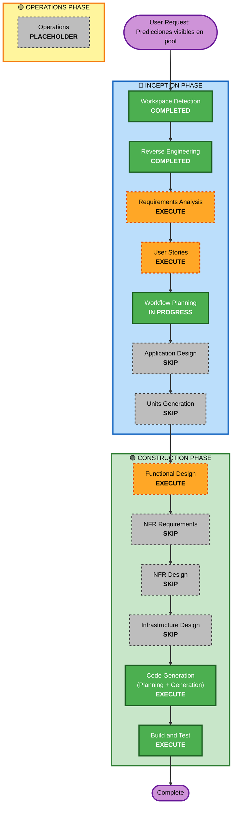

# Execution Plan — Unit 41: Predicciones visibles dentro del pool

## Detailed Analysis Summary

### Transformation Scope (Brownfield)
- **Transformation Type**: Single component addition within existing feature boundaries
- **Primary Changes**: New query + component to expose pool members' predictions for past matches
- **Related Components**: None outside pools/predictions/scoring features

### Change Impact Assessment
- **User-facing changes**: Yes — new "Predicciones" tab on `/pools/[id]` showing members' predictions grouped by match day
- **Structural changes**: No — no architectural changes
- **Data model changes**: No — reuses existing `Prediction`, `PredictionScore`, `Match`, `PoolMembership` models
- **API changes**: No — server component with Prisma query, no new routes or actions
- **NFR impact**: None — read-only query, standard Prisma indexing, no new caching needs

### Component Relationships (Brownfield)
- **Primary Component**: `src/features/pools/` (new query + new component)
- **Dependent Components**: `src/app/(app)/pools/[id]/page.tsx` (tab integration)
- **Supporting Components**: `src/i18n/dictionaries/{es,en}.ts` (new keys)
- **Reused Types**: `src/features/predictions/types.ts` (PredictionView, PredictionPointsStatus), `src/features/scoring/compute-score.ts` (ScoreBreakdown)

### Risk Assessment
- **Risk Level**: Low — additive only, no mutations, read-only, existing membership auth gate
- **Rollback Complexity**: Trivial — remove component import + tab, revert to prior state
- **Testing Complexity**: Moderate — query logic + component rendering + integration tests

## Workflow Visualization

## Phases to Execute

### 🔵 INCEPTION PHASE
- [ ] Workspace Detection — COMPLETED (not re-run)
- [ ] Reverse Engineering — COMPLETED (not re-run)
- [ ] **Requirements Analysis** — **EXECUTE (Minimal)**
  - **Rationale**: Document Épica 41 (FR-REFINE-41.1–41.5) in requirements.md. User's intent and scope are clear from reverse engineering findings + 4 clarifying questions already answered. Minimal depth: concise functional requirements with scope constraints.
- [ ] **User Stories** — **EXECUTE (Light)**
  - **Rationale**: User-facing feature with clear acceptance criteria (new tab, by-day view, kickoff trigger). Single story US-41.1. Light depth: one story with acceptance criteria.
- [x] Workflow Planning — IN PROGRESS
- [ ] Application Design — **SKIP**
  - **Rationale**: Changes within existing pool feature boundaries. No new services, methods, cross-feature contracts, or data models. The pattern (Prisma query → server component → page integration → i18n) is well-established across 40 prior units in this codebase. Simple component composition.
- [ ] Units Generation — **SKIP**
  - **Rationale**: Single straightforward unit (Unit 41). No decomposition needed. The unit is already defined: query + component + page integration + i18n + tests.

### 🟢 CONSTRUCTION PHASE
- [ ] **Functional Design** — **EXECUTE (Light)**
  - **Rationale**: New query contract (`getPoolMemberPredictions`), new component spec (`PoolPredictionsView`), page integration contract (tabs). Light depth: query signature, component props, tab structure, validation rules.
- [ ] NFR Requirements — **SKIP**
  - **Rationale**: No new NFR. Read-only query over indexed data. No new security considerations beyond existing membership gate. No performance concerns (single aggregation, not on hot path).
- [ ] NFR Design — **SKIP**
  - **Rationale**: No NFR requirements to design for.
- [ ] Infrastructure Design — **SKIP**
  - **Rationale**: No infrastructure changes. Same Vercel deployment, same Supabase database, same Prisma adapter.
- [ ] **Code Generation** — **EXECUTE** (ALWAYS)
  - **Rationale**: Implementation of the functional design — query, component, page integration, i18n keys, tests.
- [ ] **Build and Test** — **EXECUTE** (ALWAYS)
  - **Rationale**: Run `pnpm test`, `pnpm exec tsc --noEmit`, `pnpm build`, Biome, ESLint verification.

### 🟡 OPERATIONS PHASE
- [ ] Operations — PLACEHOLDER
  - **Rationale**: Future deployment and monitoring workflows.

## Package Change Sequence (Brownfield)

Single-unit change within monolith. No cross-package coordination needed.

| Step | Component | Change Type | Reason |
|------|-----------|-------------|--------|
| 1 | `requirements.md` | Patch | Add Épica 41 (FR-REFINE-41.1–41.5) |
| 2 | `stories.md` | Patch | Add Épica 41 (US-41.1) |
| 3 | `unit-of-work.md` | Patch | Add Unit 41 + sequence #25 |
| 4 | `aidlc-state.md` | Patch | Add Unit 41 stage tracking |
| 5 | Functional Design | New | Query contract + component spec |
| 6 | `src/i18n/dictionaries/{es,en}.ts` | Patch | New keys under `pools.predictions.*` |
| 7 | `src/features/pools/queries.ts` | Patch | New `getPoolMemberPredictions()` |
| 8 | `src/features/pools/components/pool-predictions-view.tsx` | New | Server component: by-day table |
| 9 | `src/app/(app)/pools/[id]/page.tsx` | Patch | Add "Predicciones" tab |
| 10 | Tests | New | Query + component + integration |

## Estimated Timeline
- **Total Stages**: 4 (Requirements, Stories, Functional Design, Code Generation + Build & Test)
- **Estimated Duration**: 2-3 iterations (refine-style, well-understood scope)

## Success Criteria
- **Primary Goal**: Pool members can view each other's predictions for matches that have started, grouped by day
- **Key Deliverables**:
  - `getPoolMemberPredictions(poolId, userId)` — Prisma query with membership gate
  - `PoolPredictionsView` — server component rendering by-day prediction table
  - "Predicciones" tab integrated into `/pools/[id]` page
  - i18n keys ES + EN for all new UI copy
  - Tests: query logic, component rendering, integration
- **Quality Gates**:
  - `pnpm exec tsc --noEmit` — 0 errors
  - `pnpm check` — Biome clean on touched files
  - `pnpm lint` — ESLint 0 errors
  - `pnpm test` — all tests passing (existing + new)
  - `pnpm build` — successful production build
  - Integration: pool detail page renders without regressions
