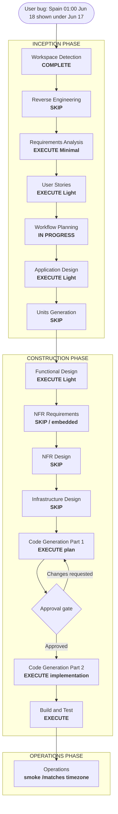

# Execution Plan — Unit 42: Agrupación de partidos por día local del usuario

## Status

- **Stage**: Workflow Planning — READY FOR REVIEW
- **Unit**: Unit 42, refine post-construcción sobre `/matches` y vistas dependientes por jornada
- **Created**: 2026-06-17T23:58:00Z
- **Approval Gate**: Waiting for explicit approval before Requirements Analysis / dependent artifact updates / implementation

## Intent

Bug reportado por el usuario: está en zona horaria de España y en `/matches` ve un partido que ocurre a sus 01:00 del 18 de junio, pero aparece dentro del bloque de 17 de junio. El detalle del partido muestra bien la hora. La causa documental probable es que FR-REFINE-16.2 fijó el agrupamiento por día en UTC; Unit 30 y Unit 41 heredaron ese criterio.

## Workspace Detection Summary

- Existing AI-DLC project detected (`aidlc-docs/aidlc-state.md`).
- Brownfield repository with Units 1–41 implemented and verified.
- Requested core workflow path `.aidlc/aidlc-rules/aws-aidlc-rules/core-workflow.md` is not present in this workspace; proceeding with the established AI-DLC workflow pattern used by Units 35–41.
- Reverse Engineering rerun is not needed: the impacted artifacts and behavior are already localized to fixture day grouping and dependent day-based views.

## Scope / Impact Assessment

- **User-facing**: yes. `/matches` day headers must match the user's local calendar day, so a 01:00 Spain kickoff on 18 June appears under 18 June.
- **Primary affected behavior**: day grouping key/label and "past/current" partitioning on `/matches`.
- **Dependent behavior**: pool predictions by day (Unit 41) should use the same day semantics to avoid future inconsistency.
- **Not affected**: match detail time display, kickoff lock, prediction visibility (`kickoffAt <= now`), scoring, sync, admin, schema, migrations, routes.
- **Risk**: medium-low. Date/time logic is subtle and spans server/client boundaries, but code impact should be narrow and testable with deterministic timezone inputs.

## Stage Decisions

### Inception

- Workspace Detection: COMPLETE.
- Reverse Engineering: SKIP. Existing artifacts and targeted code inspection are sufficient.
- Requirements Analysis: **EXECUTE (Minimal)**.
  - Add Unit 42 / Épica 42 requirements.
  - Update or supersede the UTC clauses in FR-REFINE-16.2, FR-REFINE-30.1/30.4, and FR-REFINE-41.3.
  - Acceptance: `/matches` groups by the user's local calendar day; Spain 2026-06-18 01:00 appears under 18 June.
- User Stories: **EXECUTE (Light)**.
  - Add one story for seeing matches in the expected local-day block.
  - Update Unit 41 acceptance text that currently says UTC.
- Workflow Planning: **IN PROGRESS / this artifact**.
- Application Design: **EXECUTE (Light)**.
  - Add Unit 42 to `unit-of-work.md` and sequence.
  - Update dependency summary that currently says Unit 16 fixture is ordered by day with UTC.
- Units Generation: **SKIP**.
  - Single refine unit. No decomposition needed.

### Construction

- Functional Design: **EXECUTE (Light)**.
  - Update Unit 16 design for `groupFixtureByDay` timezone source and fallback.
  - Update Unit 30 design for past/current partition by local day.
  - Update Unit 41 design for pool predictions day grouping consistency.
  - Define code contract for deterministic tests (timezone parameter or equivalent pure helper).
- NFR Requirements: **SKIP formal / embed in Functional Design**.
  - No new NFR category. Preserve `/matches` caching and avoid new DB round-trips.
- NFR Design: **SKIP**.
- Infrastructure Design: **SKIP**.
  - No schema, migrations, env vars, storage, auth, provider, or deploy topology changes.
- Code Generation Part 1: **EXECUTE after Functional Design approval**.
  - Create an explicit implementation plan before code changes.
- Code Generation Part 2: **WAIT for explicit approval after codegen plan**.
- Build and Test: **EXECUTE**.
  - Focused tests for timezone boundary, then typecheck/lint/build as scope requires.

## Workflow Visualization

Mermaid validation: syntax uses standard `flowchart TD`, subgraphs, simple node labels, and one decision node; no nested markdown bullets or unsupported directives.

## Proposed Artifact Changes After Approval

| Artifact | Planned change |
|---|---|
| `inception/requirements/requirements.md` | Add Épica 42; update/supersede UTC wording in FR-REFINE-16.2, FR-REFINE-30.1/30.4, FR-REFINE-41.3 |
| `inception/user-stories/stories.md` | Add US-42.1; update Unit 41 acceptance criterion that says UTC |
| `inception/application-design/unit-of-work.md` | Add Unit 42 + implementation sequence item |
| `inception/application-design/unit-of-work-dependency.md` | Replace "fixture ordered by day with UTC" with local-day semantics |
| `construction/unit-16-onboarding-gate-fixture-order/functional-design.md` | Update `groupFixtureByDay` design from UTC to user local timezone/fallback |
| `construction/unit-30-matches-past-filter/functional-design.md` | Update `today`/partition design from UTC to same local-day key |
| `construction/unit-41-pool-predictions/functional-design.md` | Align day grouping with `/matches` local-day semantics |
| `aidlc-state.md` / `audit.md` | Track Unit 42 approval gate and decisions |

## Proposed Implementation Shape (For Later Code Generation)

- Update the pure date grouping helper used by `/matches` so day key and label are derived from an explicit timezone.
- Determine the user's timezone without changing URLs or adding schema. Preferred minimal path: pass browser timezone from a client wrapper to the grouping/partition logic if the current server-only render cannot know it reliably; fallback to a stable app default only when unavailable.
- Keep match detail time formatting unchanged, because it already displays correctly.
- Update Unit 30 partitioning so "past days" means days before today in the same timezone as grouping.
- Update Unit 41 grouping only if its current implementation uses UTC; keep prediction visibility based on absolute kickoff (`kickoffAt <= now`).

## Verification Plan

- Focused unit tests for `groupFixtureByDay` or replacement helper:
  - `2026-06-17T23:00:00Z` with `Europe/Madrid` groups under `2026-06-18`.
  - same instant with `UTC` groups under `2026-06-17`.
  - ordering within local day remains by absolute kickoff time.
  - `kickoffAt = null` remains in "Fecha por confirmar".
- Focused tests for past/current partition:
  - `today` in `Europe/Madrid` hides only days strictly before the local day.
- Existing tests updated only where UTC expectations are intentionally superseded.
- `pnpm exec tsc --noEmit`.
- Biome/ESLint on touched source files.
- Focused Vitest for predictions/matches date helpers; full suite/build if implementation touches shared components.

## Security Baseline Compliance

- SECURITY-08: N/A. No authorization changes.
- SECURITY-05: N/A/low. Timezone string must be validated/coerced before passing to `Intl.DateTimeFormat`; invalid values fall back safely.
- SECURITY-03/04/06/07/09/10/11/12/13/14: N/A. No sensitive data, crypto, XSS, rate limit, logging, auth, or dependency changes.

## Approval Gate

Do not update requirements/user-stories/designs or implement code until this execution plan is approved.
