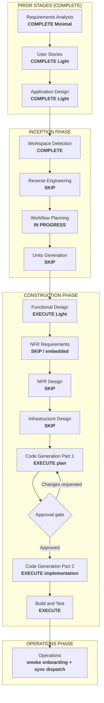

# Execution Plan — Unit 43: Web Push — Onboarding step + dispatch en sync admin

## Status

- **Stage**: Workflow Planning — READY FOR REVIEW
- **Unit**: Unit 43, refine post-construcción sobre Unit 10 (Web Push), Unit 7 (Admin Sync) y Unit 2 (Onboarding)
- **Created**: 2026-06-18T00:00:00Z
- **Approval Gate**: Waiting for explicit approval before Functional Design / implementation

## Intent

Dos gaps operativos en Web Push (Unit 10, construida y verificada con 115 tests, VAPID keys configuradas):

1. **FR-REFINE-43.1**: el usuario solo puede activar push desde `/settings/profile`. No hay prompt durante el onboarding. Se añade un paso "Notificaciones" entre reglas y passkey (skippable, 5 tipos activados por defecto).
2. **FR-REFINE-43.2**: el sync admin (`triggerSync`) encola eventos `NotificationEvent` (MATCH_STARTED, MATCH_FINISHED, GOAL_SCORED) pero **nunca** invoca `dispatchPendingNotifications()`. Los eventos quedan PENDING indefinidamente. Se añade la llamada al dispatcher al final del sync.

Decisión del usuario (AskUserQuestion): prompt en el onboarding, disparar notificaciones existentes (no nuevo tipo), audiencia = usuarios con predicciones (ya manejado por `getMatchNotificationRecipients()`).

## Workspace Detection Summary

- Existing AI-DLC project detected (`aidlc-docs/aidlc-state.md`).
- Brownfield repository with Units 1–42 implemented and verified.
- Unit 43 delta documental ya aplicado: requirements (FR-REFINE-43.1/.2), user stories (US-43.1/.2), unit-of-work (#29), dependency matrix, dependent designs (Unit 10/2/7 generation summaries).
- Requested core workflow path `.aidlc/aidlc-rules/aws-aidlc-rules/core-workflow.md` is not present; proceeding with the established AI-DLC workflow pattern used by Units 35–42.
- Reverse Engineering rerun is not needed: the impacted components and behavior are localized to onboarding step management and sync action.

## Scope / Impact Assessment

- **User-facing**: yes. Nuevo paso visible en el onboarding para activar notificaciones. Los usuarios con predicciones reciben push tras sync admin (antes solo se encolaban).
- **Primary affected behavior**:
  - Onboarding: secuencia de pasos (nickname → avatar → reglas → **notificaciones** → passkey), indicador de progreso, i18n.
  - Sync admin: `triggerSync()` gana una llamada `dispatchPendingNotifications()` al final.
- **Dependent behavior**: `emitMatchNotificationEvents` y `dispatchPendingNotifications` sin cambios internos.
- **Not affected**: schema, migraciones, rutas, scoring, predicciones, locks, auth, VAPID keys, dispatcher internals, tipos de `NotificationEventType`, `NotificationSettingsPanel`.
- **Risk**: low. El paso de onboarding es una adición de componente con patrón existente (4 pasos previos). El dispatch en sync es una llamada a función existente con try/catch, best-effort.

## Stage Decisions

### Inception

- Workspace Detection: COMPLETE.
- Reverse Engineering: SKIP. Existing artifacts and code inspection are sufficient.
- Requirements Analysis: **COMPLETE (Minimal)** — delta ya aplicado.
  - FR-REFINE-43.1: paso de notificaciones en onboarding entre reglas y passkey, skippable, 5 tipos activados.
  - FR-REFINE-43.2: `dispatchPendingNotifications()` al final de `triggerSync()`, best-effort.
- User Stories: **COMPLETE (Light)** — delta ya aplicado.
  - US-43.1: activar notificaciones push durante el onboarding.
  - US-43.2: recibir notificaciones de partido cuando el admin sincroniza.
- Workflow Planning: **IN PROGRESS / this artifact**.
- Application Design: **COMPLETE (Light)** — delta ya aplicado.
  - Unit 43 en `unit-of-work.md` con secuencia #29.
  - Dependency matrix actualizada (Units 10, 7, 2 → 43).
  - Dependent designs (Unit 10/2/7 generation summaries) anotados.
- Units Generation: **SKIP**.
  - Single refine unit. No decomposition needed.

### Construction

- Functional Design: **EXECUTE (Light)**.
  - Definir contrato del `NotificationStep` (props, skippable, estados: unsupported/missing-vapid/denied/activated).
  - Definir integración en `onboarding-client.tsx` (nuevo step en `Step` union type, `STEP_ORDER`, render block).
  - Definir integración en `onboarding-progress-indicator.tsx` (nuevo indicador `stepNotifications`).
  - Definir claves i18n (7 claves `onboarding.notifications*` en `es`/`en`).
  - Definir inserción de `dispatchPendingNotifications()` en `trigger-sync.ts` (posición, try/catch, sin cambio de signature ni retorno).
  - NFR/Infra SKIP formal.
- NFR Requirements: **SKIP formal / embed in Functional Design**.
  - Dispatch best-effort (no revierte sync/scoring).
  - Sin nuevos round-trips ni queries (el paso de onboarding reutiliza `NotificationSettingsPanel`).
- NFR Design: **SKIP**.
- Infrastructure Design: **SKIP**.
  - Sin schema, migraciones, env vars, storage, auth, provider, routes ni deploy topology.
- Code Generation Part 1: **EXECUTE after Functional Design approval**.
  - Create explicit implementation plan before code changes.
- Code Generation Part 2: **WAIT for explicit approval after codegen plan**.
- Build and Test: **EXECUTE**.
  - Focused tests para `NotificationStep`, integración en `onboarding-client`, y `triggerSync` con dispatch.

## Workflow Visualization

Mermaid validation: syntax uses standard `flowchart TD`, subgraphs, simple node labels, decision node; no nested markdown bullets or unsupported directives.

## Proposed Implementation Shape (For Later Code Generation)

### FR-REFINE-43.1: Paso de notificaciones en onboarding

| Archivo | Cambio |
|---|---|
| `src/features/profile/components/notification-step.tsx` (NUEVO) | Componente cliente. Recibe `onComplete` + `onSkip`. Renderiza prompt de activación push reutilizando lógica de `NotificationSettingsPanel` (permiso browser → register SW → subscribe → save). Estados: `unsupported` (navegador no soporta), `missingVapid` (falta `NEXT_PUBLIC_VAPID_PUBLIC_KEY`), `denied` (permiso denegado), `activated` (suscripción activa). Botón "Activar notificaciones" / "Omitir". Al activar, inicializa 5 preferencias como `true`. |
| `src/app/onboarding/profile/onboarding-client.tsx` | Añadir `"notifications"` al tipo `Step`. Insertar en `STEP_ORDER` entre `"rules"` y `"passkey"`. Añadir bloque render: `{step === "notifications" && <NotificationStep onComplete={() => setStep("passkey")} onSkip={() => setStep("passkey")} />}`. Ajustar `setStep` de RulesStep: `onComplete` → `setStep("notifications")`. |
| `src/features/profile/components/onboarding-progress-indicator.tsx` | Añadir `{ labelKey: "stepNotifications", key: "notifications" }` a `STEPS` entre `stepRules` y `stepPasskey`. |
| `src/i18n/dictionaries/es.ts` | Añadir 7 claves bajo `onboarding.notifications*`: `notificationsTitle`, `notificationsDescription`, `notificationsEnable`, `notificationsSkip`, `notificationsActivated`, `notificationsUnsupported`, `notificationsMissingVapid`. |
| `src/i18n/dictionaries/en.ts` | Equivalente en inglés. |

### FR-REFINE-43.2: Dispatch en sync admin

| Archivo | Cambio |
|---|---|
| `src/features/admin/actions/trigger-sync.ts` | Importar `dispatchPendingNotifications` desde `@/features/notifications/services/dispatcher`. Al final del action (después de `scoreFinishedUnscoredMatches()` y `revalidateResultViews()`), añadir `try { await dispatchPendingNotifications() } catch { /* best-effort */ }`. Sin cambio de signature, retorno ni comportamiento de sync/scoring. |

## Verification Plan

- Focused tests para `NotificationStep`:
  - Render con VAPID key disponible: muestra botón "Activar notificaciones".
  - Render sin `NEXT_PUBLIC_VAPID_PUBLIC_KEY`: muestra mensaje de configuración faltante.
  - Render en navegador sin soporte: muestra mensaje de no soportado.
  - Botón "Omitir" llama `onSkip()`.
- Test de integración en `onboarding-client`:
  - Secuencia de pasos incluye "notifications" entre "rules" y "passkey".
  - `RulesStep.onComplete` → `setStep("notifications")`.
  - `NotificationStep.onComplete` / `onSkip` → `setStep("passkey")`.
- Test de `triggerSync`:
  - `dispatchPendingNotifications` es llamado tras sync+scoring exitoso.
  - Si `dispatchPendingNotifications` lanza, el error no se propaga (best-effort).
  - Si sync/scoring falla, no se llama al dispatcher.
- `pnpm exec tsc --noEmit`.
- Biome/ESLint on touched source files.
- Focused Vitest; full suite si el cambio toca imports compartidos.

## Security Baseline Compliance

- SECURITY-08: N/A. No authorization changes. El gate admin de `triggerSync` sigue intacto.
- SECURITY-05: N/A. Sin nuevos inputs de usuario. El paso de notificaciones reutiliza `NotificationSettingsPanel` que ya valida.
- SECURITY-03/04/06/07/09/10/11/12/13/14: N/A. Sin datos sensibles, crypto, XSS, rate limiting, logging, auth ni dependency changes.
- SECURITY-12 (payload privacy): N/A. Los payloads de push ya son mínimos y no exponen datos privados por diseño de Unit 10.

## Artifact Changes After Approval

| Artifact | Planned change |
|---|---|
| `aidlc-state.md` | Marcar Workflow Planning COMPLETE; actualizar Current Stage |
| `audit.md` | Entrada de auditoría para Workflow Planning |
| `construction/unit-43-web-push-onboarding-dispatch/functional-design.md` (NUEVO) | Functional Design light con contratos, reglas de negocio, componentes, i18n |
| `construction/plans/unit-43-web-push-onboarding-dispatch-code-generation-plan.md` (NUEVO, tras FD approval) | Code Generation Part 1 plan |
| Application code (workspace root) | `notification-step.tsx`, `onboarding-client.tsx`, `onboarding-progress-indicator.tsx`, `trigger-sync.ts`, i18n `es.ts`/`en.ts` |

## Approval Gate

Do not proceed to Functional Design or implement code until this execution plan is approved.
