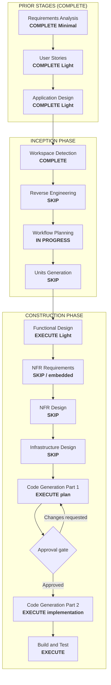

# Execution Plan — Unit 44: Autocompletar nickname al invitar a una liga

## Status

- **Stage**: Workflow Planning — APPROVED (2026-06-18T02:45:00Z) → Functional Design — COMPLETE
- **Unit**: Unit 44, refine post-construccion sobre Unit 3 (Pools), Unit 10 (Directed Invites), Unit 13 (Invitaciones Refine)
- **Created**: 2026-06-18T02:30:00Z
- **Approval Gate**: Functional Design COMPLETE / awaiting explicit approval for Code Generation Part 1

## Intent

El `DirectedInviteForm` actual (sidebar en `/pools/[id]`, gateado a `pool.isOwner`) es un `<Input>` plano: el owner debe escribir el nickname completo en formato `Base#1234` de memoria. Si escribe mal el discriminator o la base, el server action `createDirectedInvite` falla con "No encontramos un usuario con ese nickname".

**Correccion del usuario (2026-06-18)**: la invitacion dirigida debe estar disponible para **cualquier miembro del pool**, no solo el owner. Esto implica dos cambios de permiso ademas del autocompletar: (a) el gate UI `pool.isOwner` → verificar membresia; (b) el gate server-side `pool.ownerId !== userId` → verificar que el inviter es miembro.

Se añade autocompletar mientras se escribe:

1. **FR-REFINE-44.1**: al escribir >=2 caracteres (y el texto no contiene `@`), aparece un dropdown con sugerencias de nicknames coincidentes.
2. **FR-REFINE-44.2**: búsqueda server-side por `startsWith` case-insensitive sobre `nicknameBase`, perfiles activos (`deletedAt IS NULL`).
3. **FR-REFINE-44.3**: cada sugerencia muestra avatar + nickname formateado `base#discriminator`.
4. **FR-REFINE-44.4**: si el texto contiene `@`, no se muestra autocompletar (es email, comportamiento actual).
5. **FR-REFINE-44.5**: maximo 8 resultados ordenados alfabeticamente.
6. **FR-REFINE-44.6**: nuevo server action `searchNicknames(query)` que valida entrada y devuelve solo datos publicos (id, nickname components, avatar).

`createDirectedInvite` y el flujo de push NO cambian.

## Workspace Detection Summary

- Existing AI-DLC project detected (`aidlc-docs/aidlc-state.md`).
- Brownfield repository with Units 1–43 implemented and verified.
- Unit 44 delta documental ya aplicado: requirements (FR-REFINE-44.1…44.6), user stories (US-44.1), unit-of-work (#30), dependency matrix (Units 3, 10, 13), dependent designs (Unit 3 frontend-components.md, Unit 13 functional-design.md).
- Core workflow file (`.aidlc/aidlc-rules/aws-aidlc-rules/core-workflow.md`) present; proceeding with established AI-DLC workflow pattern.
- Reverse Engineering rerun is not needed: the impacted components (`DirectedInviteForm`, new `searchNicknames` action) are localized and additive.

## Scope / Impact Assessment

- **User-facing**: yes. El owner de una liga ve un dropdown con sugerencias al escribir en el campo de invitacion.
- **Primary affected behavior**:
  - `DirectedInviteForm`: gana logica de autocompletar (estado de sugerencias, debounce, render de dropdown, seleccion).
  - Nuevo server action `searchNicknames`: consulta Prisma con `startsWith` sobre `nicknameBase`.
  - **Permisos de invitacion**: el gate UI (`pool.isOwner`) y el gate server-side (`pool.ownerId !== userId`) se reemplazan por verificacion de membresia — **cualquier miembro** del pool puede invitar (correccion del usuario).
- **Not affected**: `resolveUserByTarget`, `PoolDirectedInvite`, push notifications, schema, migraciones, rutas, scoring, predicciones, auth, sync, admin.
- **Risk**: low. Componente aditivo (dropdown + server action). El cambio de permisos es un relajamiento (owner → miembro): menos restrictivo, no rompe funcionalidad existente. Sin cambios en el flujo de envio ni en la resolucion de usuarios. La query de busqueda es acotada (take 8, sin joins pesados, solo datos publicos).
- **Files**:
  - NUEVO: `src/features/pools/actions/search-nicknames.ts` (server action)
  - MODIFICADO: `src/features/pools/components/directed-invite-form.tsx` (dropdown + debounce)
  - MODIFICADO: `src/features/pools/actions/create-directed-invite.ts` (gate owner → miembro)
  - MODIFICADO: `src/app/(app)/pools/[id]/page.tsx` (gate UI `pool.isOwner` → membresia)
  - NUEVO (opcional): `src/features/pools/components/nickname-autocomplete.tsx` (componente extraido)
  - TEST: `src/features/pools/actions/__tests__/search-nicknames.test.ts` (NUEVO)
  - TEST: `src/features/pools/actions/__tests__/create-directed-invite.test.ts` (MODIFICADO — nuevo caso: miembro no-owner puede invitar)
  - TEST: `src/features/pools/components/__tests__/directed-invite-form.test.tsx` (MODIFICADO/NUEVO)
  - i18n: sin nuevas claves (reutiliza `invitePlaceholder`, `inviteAria` existentes).

## Stage Decisions

### Inception

- Workspace Detection: **COMPLETE**. Existing AI-DLC project resume.
- Reverse Engineering: **SKIP**. Existing artifacts and code inspection are sufficient. Localized additive change.
- Requirements Analysis: **COMPLETE (Minimal)** — delta ya aplicado.
  - FR-REFINE-44.1: autocompletar >=2 chars si no es email, dropdown con sugerencias.
  - FR-REFINE-44.2: busqueda `startsWith` case-insensitive sobre `nicknameBase`.
  - FR-REFINE-44.3: sugerencias con avatar + `base#discriminator`.
  - FR-REFINE-44.4: sin autocompletar si contiene `@`.
  - FR-REFINE-44.5: max 8 resultados.
  - FR-REFINE-44.6: server action `searchNicknames(query)`.
  - **Nuevo (correccion del usuario)**: el gate de invitacion cambia de owner a cualquier miembro del pool (UI + server-side).
- User Stories: **COMPLETE (Light)** — delta ya aplicado.
  - US-44.1: buscar y seleccionar nickname mientras se escribe en el campo de invitacion.
- Workflow Planning: **COMPLETE / APPROVED**.
- Application Design: **COMPLETE (Light)** — delta ya aplicado.
  - Unit 44 en `unit-of-work.md` con secuencia #30.
  - Dependency matrix actualizada (depende de Units 3, 10, 13).
  - Dependent designs (Unit 3, Unit 13) anotados.
- Units Generation: **SKIP**.
  - Single refine unit. No decomposition needed.

### Construction

- Functional Design: **COMPLETE (Light)**.
  - `construction/unit-44-nickname-autocomplete-invite/functional-design.md` created.
  - BR-44.1…BR-44.8, SearchNicknameResult type, SearchNicknameSchema, contracts for DirectedInviteForm + searchNicknames, permission change to any-member, file plan, Security Baseline, verification plan.
  - NFR/Infra SKIP formal.
- NFR Requirements: **SKIP formal / embed in Functional Design**.
  - Debounce client-side para no saturar el servidor.
  - Query acotada (take 8, sin joins a `auth.users`, solo datos publicos).
  - Security: `searchNicknames` no expone emails, user IDs sensibles ni relaciones.
- NFR Design: **SKIP**.
- Infrastructure Design: **SKIP**.
  - Sin schema, migraciones, env vars, storage, auth, provider, routes ni deploy topology.
- Code Generation Part 1: **EXECUTE after Functional Design approval**.
  - Create explicit implementation plan before code changes.
- Code Generation Part 2: **WAIT for explicit approval after codegen plan**.
- Build and Test: **EXECUTE**.
  - Focused tests para `searchNicknames` (server action) + `DirectedInviteForm` (dropdown behavior).

## Workflow Visualization

## Proposed Implementation Shape (For Later Code Generation)

### FR-REFINE-44.6: Server action `searchNicknames`

| Archivo | Cambio |
|---|---|
| `src/features/pools/actions/search-nicknames.ts` (NUEVO) | Server action. Recibe `query: string` (raw). Valida con Zod: min 2 chars trim, regex `^[a-zA-Z0-9_-]+$` (solo base, sin `#` ni `@`). Consulta Prisma: `profile.findMany({ where: { nicknameBase: { startsWith: query, mode: "insensitive" }, deletedAt: null }, select: { id: true, nicknameBase: true, nicknameDiscriminator: true, avatarUrl: true }, orderBy: [{ nicknameBase: "asc" }, { nicknameDiscriminator: "asc" }], take: 8 })`. Retorna `SearchNicknameResult[]` o `{ error }`. Sin acceso a `auth.users` ni emails. |
| `src/features/pools/types.ts` | Añadir `SearchNicknameResult` type: `{ id: string; nicknameBase: string; nicknameDiscriminator: string; avatarUrl: string }`. |

### FR-REFINE-44.1…44.5: Autocompletar en `DirectedInviteForm`

| Archivo | Cambio |
|---|---|
| `src/features/pools/components/directed-invite-form.tsx` | Modificar para: (1) estado `suggestions: SearchNicknameResult[]`, `showDropdown`, `highlightIndex`; (2) `useEffect` con debounce 250ms sobre `target` que llama `searchNicknames(target)` solo si `target.length >= 2 && !target.includes("@")`, limpiando sugerencias si `<2` chars o contiene `@`; (3) renderizar dropdown posicionado debajo del input con `<ul>` de sugerencias (avatar 24px + `base#discriminator`); (4) `onKeyDown` para navegacion con teclado: ArrowDown/ArrowUp mueven `highlightIndex`, Enter selecciona, Escape cierra; (5) `onClick` en sugerencia → `setTarget(base#discriminator)`, cierra dropdown; (6) loading spinner miniatura en el dropdown mientras se consulta. Sin cambios en `submit()` ni en el boton. |
| `src/features/pools/components/nickname-autocomplete.tsx` (opcional, NUEVO) | Si el dropdown se extrae a componente propio para mantener `DirectedInviteForm` limpio: recibe `query`, `onSelect`, y contiene toda la logica de busqueda/estados/teclado. `DirectedInviteForm` lo monta y solo maneja el `target` global. |

### Cambio de permisos: cualquier miembro puede invitar

| Archivo | Cambio |
|---|---|
| `src/app/(app)/pools/[id]/page.tsx` | Gate UI: `pool.isOwner` → verificar que el usuario es miembro del pool (ej. `pool.isMember` o `memberCount > 0 && membership exists`). `DirectedInviteForm` se renderiza para cualquier miembro, no solo el owner. |
| `src/features/pools/actions/create-directed-invite.ts` | Gate server-side: `pool.ownerId !== userId` → verificar que `userId` tiene una `PoolMembership` activa en ese pool. Si no es miembro, retorna error "Debes ser miembro de la liga para invitar". El owner sigue pudiendo invitar (es miembro). |

### Sin cambios

| Archivo | Razon |
|---|---|
| `src/features/pools/actions/create-directed-invite.ts` | La resolucion de nickname/email y el flujo de push no cambian. Solo cambia el gate de autorizacion (owner → miembro). |
| `src/features/pools/schemas.ts` | `CreateDirectedInviteSchema` sin cambios. |
| `src/i18n/dictionaries/{es,en}.ts` | Sin nuevas claves: el placeholder y aria-label existentes se reutilizan. |
| `prisma/schema.prisma` | Sin cambios de modelo. |

## Verification Plan

- Test de `searchNicknames` server action:
  - Query de 2 chars retorna resultados coincidentes.
  - Query de 1 char retorna error de validacion.
  - Query con `#` retorna error de validacion (solo base).
  - Query con `@` retorna error de validacion.
  - Resultados ordenados alfabeticamente.
  - Max 8 resultados.
  - Perfiles con `deletedAt != null` excluidos.
  - Case-insensitive (ej. "pepe" matchea "Pepe").
- Test de `createDirectedInvite` cambio de permisos:
  - Miembro no-owner puede crear invitacion dirigida (antes rechazado).
  - No-miembro recibe error "Debes ser miembro de la liga para invitar".
  - Owner sigue pudiendo invitar (es miembro).
  - Usuario sin onboarding completado recibe error igual que antes.
- Test de `DirectedInviteForm` dropdown:
  - Escribir 2+ chars muestra dropdown con sugerencias.
  - Escribir `<2` chars no muestra dropdown.
  - Escribir texto con `@` no muestra dropdown.
  - Seleccionar sugerencia con click rellena el input.
  - Navegar con teclas (ArrowDown/ArrowUp/Enter/Escape) funciona.
  - Dropdown se cierra al seleccionar o al presionar Escape.
  - Loading state visible durante la consulta.
  - El boton "Invitar" y `submit()` no cambian su comportamiento.
- `pnpm exec tsc --noEmit`.
- Biome/ESLint on touched source files.
- Focused Vitest; full suite si el cambio toca imports compartidos.

## Security Baseline Compliance

- SECURITY-01: N/A. Autenticacion sin cambios. `getOnboardedUserId()` ya se exige en `createDirectedInvite`.
- SECURITY-02: N/A. Sin datos de pago ni crypto.
- SECURITY-03: N/A. Sin secrets, keys ni env vars nuevas.
- SECURITY-04: N/A. Sin cambios en CSP ni scripts inline.
- SECURITY-05: **COMPLIANT**. El server action `searchNicknames` valida input con Zod (min 2 chars, regex `[a-zA-Z0-9_-]+`). El dropdown es client-side con datos del server ya validados.
- SECURITY-06: N/A. Sin operaciones criptograficas nuevas.
- SECURITY-07: N/A. Sin rate limiting requerido (query acotada a take 8, debounce client-side de 250ms).
- SECURITY-08: **COMPLIANT**. `searchNicknames` solo expone datos publicos de perfil (nickname, avatar). No expone emails, `auth.users` IDs, relaciones ni datos sensibles. `createDirectedInvite` mantiene su gate de autorizacion (owner + onboarded).
- SECURITY-09: N/A. Sin logging nuevo.
- SECURITY-10: N/A. Sin dependencias npm nuevas ni actualizaciones de paquetes.
- SECURITY-11: N/A. Sin cambios en session management.
- SECURITY-12: **COMPLIANT**. Los payloads de push no cambian; ya son minimos por diseno de Unit 10.
- SECURITY-13: N/A. Sin cambios en CSRF protection.
- SECURITY-14: N/A. Sin data exports ni reports.
- SECURITY-15: N/A. Sin cambios en backup/recovery.

## Artifact Changes After Approval

| Artifact | Planned change |
|---|---|
| `aidlc-state.md` | Marcar Workflow Planning COMPLETE; actualizar Current Stage |
| `audit.md` | Entrada de auditoria para Workflow Planning |
| `inception/requirements/requirements.md` | Actualizar FR-REFINE-44 con permiso any-member |
| `construction/unit-44-nickname-autocomplete-invite/functional-design.md` (NUEVO) | Functional Design light con contratos, reglas de negocio, tipos, permisos, verificacion |
| `construction/unit-3-pools-membership/functional-design/business-rules.md` | Actualizar BR de invitacion: owner → miembro |
| `construction/plans/unit-44-nickname-autocomplete-invite-code-generation-plan.md` (NUEVO, tras FD approval) | Code Generation Part 1 plan |
| Application code (workspace root) | `search-nicknames.ts`, `directed-invite-form.tsx`, `create-directed-invite.ts`, `page.tsx`, `types.ts`, tests |

## Approval Gate

Workflow Planning approved (2026-06-18). Functional Design COMPLETE. Do not proceed to Code Generation Part 1 until Functional Design is explicitly approved.
