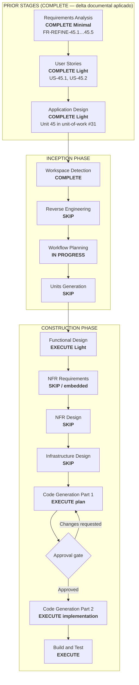

# Execution Plan — Unit 45: Permiso configurable de invitación por miembros en pools privados

## Status

- **Stage**: Workflow Planning — IN PROGRESS / Awaiting Approval
- **Unit**: Unit 45, refine post-construcción sobre Unit 3 (Pools), Unit 13 (Invitaciones Refine), Unit 44 (Autocompletar)
- **Created**: 2026-06-18
- **Approval Gate**: Waiting for explicit approval before Functional Design

## Intent

El owner de un pool **privado** quiere decidir si los miembros (no-owner) pueden invitar a otros usuarios. Hoy (post-Unit 44), **cualquier miembro** del pool puede invitar. El nuevo comportamiento es:

- El **owner siempre puede invitar**, sin importar la preferencia.
- Los **miembros no-owner** solo pueden invitar si el owner lo permite, mediante un toggle `Pool.membersCanInvite`.
- El toggle se muestra al **crear el pool** (default `true` para mantener la compatibilidad con Unit 44) y es **editable** en cualquier momento desde una nueva sección "Configuración" en `/pools/[id]`.
- Solo aplica a pools `type === "PRIVATE"`. En pools `PUBLIC` el flag existe en el modelo pero no se muestra/usa (los públicos no usan invitación dirigida).

Esto **supersede** el comportamiento de `FR-REFINE-44.7` (cualquier miembro puede invitar), alineándolo con un modelo controlado por el owner.

## Workspace Detection Summary

- Existing AI-DLC project detected (`aidlc-docs/aidlc-state.md`).
- Brownfield repository with Units 1–44 implementadas y verificadas (última verificada: Unit 44, **310/310 tests**, `pnpm build` OK).
- Delta documental de Unit 45 ya aplicado: requirements (Épica 45, FR-REFINE-45.1…45.5, FR-REFINE-44.7 marcada como superseded), stories (US-45.1, US-45.2), unit-of-work (#31), dependency matrix, dependent designs (Unit 3 `domain-entities.md`/`business-rules.md`/`frontend-components.md`, Unit 13 `functional-design.md`, Unit 44 `functional-design.md` + code-gen plan).
- Core workflow file (`.aidlc/aidlc-rules/aws-aidlc-rules/core-workflow.md`) present; following established AI-DLC workflow pattern.
- Reverse Engineering rerun is not needed: the impacted components (`Pool` model + create/edit pool flows + invite permission gate) are localized and the surface is well understood from Unit 3/13/44 artifacts.
- `FR-REFINE-44.7` ("cualquier miembro puede invitar") se mantiene como **default** (`Pool.membersCanInvite = true`), preservando el comportamiento de Unit 44 hasta que el owner restrinja el permiso.

## Scope / Impact Assessment

- **User-facing**: yes. Tres flujos cambian para el owner:
  1. Crear un pool `PRIVATE` desde `/pools/new` → nuevo Switch "Los miembros pueden invitar" (default `true`).
  2. Editar la preferencia en `/pools/[id]` → nueva sección "Configuración" (solo owner) con el mismo Switch.
  3. Los miembros no-owner ven u ocultan el `DirectedInviteForm` según el flag (en lugar de "siempre visible" como en Unit 44).
- **Primary affected behavior**:
  - `Pool` model: nueva columna `membersCanInvite Boolean @default(true)` + migración Prisma.
  - `CreatePoolForm` (Unit 3): nuevo Switch opcional, solo si `type === "PRIVATE"`.
  - `createPool` server action: input adicional `membersCanInvite`, persiste en BD.
  - `updatePoolMembersCanInvite` server action (NUEVO): valida owner, persiste, revalida.
  - `getPoolDetail` (queries): expone `type` y `membersCanInvite` en el DTO.
  - `PoolSettingsCard` (NUEVO componente, server+client): sección "Configuración" en `/pools/[id]`, solo owner.
  - `page.tsx` (`/pools/[id]`): gate UI del `DirectedInviteForm` cambia a `isOwner || (PRIVATE && membersCanInvite)`; añade `PoolSettingsCard`.
  - `createDirectedInvite` (server action, Unit 10/13/44): gate ampliado con `isOwner || (PRIVATE && membersCanInvite)`.
- **Not affected**: `resolveUserByTarget`, `PoolDirectedInvite`, push notifications, scoring, predicciones, auth, sync, admin, scoring, kick-member, leave-pool, join-public-pool, join-pool-by-token.
- **Risk**: low-to-medium. Cambios:
  - Schema: 1 columna nueva con default `true` (no breaking, no requiere cambios de aplicación en lectura más allá de exponer el valor).
  - Lógica: gate ampliado en server action (default `true` = comportamiento idéntico a Unit 44 → no rompe nada en pools existentes).
  - UI: nuevo Switch + nueva sección "Configuración" (no quita funcionalidad existente; añade).
  - i18n: nuevas claves `pools.settings.*` (ES+EN) — aditivo.
- **Files (planned for Code Gen Part 2)**:
  - NUEVO: `prisma/migrations/20260618000000_unit45_pool_members_can_invite/` (DDL).
  - MODIFICADO: `prisma/schema.prisma` (añadir `membersCanInvite Boolean @default(true)` al `model Pool`).
  - MODIFICADO: `src/features/pools/schemas.ts` (input `membersCanInvite` en `CreatePoolSchema`; nuevo `UpdatePoolMembersCanInviteSchema`).
  - MODIFICADO: `src/features/pools/types.ts` (añadir `membersCanInvite` a `PoolDetail`).
  - MODIFICADO: `src/features/pools/queries.ts` (`getPoolDetail` selecciona `type` y `membersCanInvite`; `getMyPools` selecciona `membersCanInvite` para el directorio).
  - MODIFICADO: `src/features/pools/actions/create-pool.ts` (input `membersCanInvite`, persiste en `Pool.create`).
  - NUEVO: `src/features/pools/actions/update-pool-members-can-invite.ts` (server action; valida owner; persiste; `revalidatePath`).
  - MODIFICADO: `src/features/pools/actions/create-directed-invite.ts` (gate ampliado; ampliar `select`).
  - MODIFICADO: `src/features/pools/components/create-pool-form.tsx` (Switch opcional si `type === "PRIVATE"`).
  - MODIFICADO: `src/app/(app)/pools/[id]/page.tsx` (gate UI del `DirectedInviteForm`; montar `PoolSettingsCard`).
  - NUEVO: `src/features/pools/components/pool-settings-card.tsx` (server component que renderiza el cliente).
  - NUEVO: `src/features/pools/components/pool-settings-card-client.tsx` (cliente con Switch + `useTransition` + `sonner`).
  - MODIFICADO: `src/i18n/dictionaries/{es,en}.ts` (claves `pools.settings.*`).
  - TESTS: `update-pool-members-can-invite.test.ts` (NUEVO), `create-pool.test.ts` (NUEVO caso con `membersCanInvite`), `create-directed-invite.test.ts` (NUEVOS casos: non-owner blocked cuando `membersCanInvite=false`; non-owner allowed cuando `membersCanInvite=true`), `create-pool-form.test.tsx` (NUEVO: Switch visible solo si PRIVATE), `pool-settings-card.test.tsx` (NUEVO: switch disabled mientras pending, toast en éxito, error en fallo), `get-pool-detail.test.ts` (NUEVO: DTO expone `type`/`membersCanInvite`).
  - i18n: 5 nuevas claves × 2 idiomas = 10 strings.

## Stage Decisions

### Inception

- Workspace Detection: **COMPLETE**. Existing AI-DLC project resume.
- Reverse Engineering: **SKIP**. Artifacts existentes y código inspeccionado son suficientes. Cambio aditivo y localizado.
- Requirements Analysis: **COMPLETE (Minimal)** — delta ya aplicado.
  - FR-REFINE-45.1: toggle en `CreatePoolForm` (Switch, default `true`, solo PRIVATE).
  - FR-REFINE-45.2: owner siempre puede invitar (sin importar el flag).
  - FR-REFINE-45.3: miembros no-owner solo pueden invitar si `PRIVATE && membersCanInvite`; en otro caso, hint "Solo el administrador puede invitar en esta liga".
  - FR-REFINE-45.4: el toggle es editable en `/pools/[id]` (sección "Configuración", solo owner), en cualquier momento.
  - FR-REFINE-45.5: schema `Pool.membersCanInvite Boolean @default(true)`; migración Prisma.
  - `FR-REFINE-44.7` (Unit 44) marcado como **superseded** con nota de reenvío a Épica 45.
- User Stories: **COMPLETE (Light)** — delta ya aplicado.
  - US-45.1: decidir el permiso al crear un pool privado.
  - US-45.2: cambiar el permiso en un pool en progreso.
- Workflow Planning: **IN PROGRESS** (este documento).
- Application Design: **COMPLETE (Light)** — delta ya aplicado.
  - Unit 45 en `unit-of-work.md` con secuencia #31.
  - Dependency matrix: Unit 45 depende de Units 3, 13, 44.
  - Dependent designs: Unit 3 (`domain-entities.md`, `business-rules.md`, `frontend-components.md`), Unit 13 (`functional-design.md`), Unit 44 (`functional-design.md` + code-gen plan) anotados.
- Units Generation: **SKIP**. Single refine unit. No decomposition needed.

### Construction

- Functional Design: **EXECUTE (Light)**.
  - `construction/unit-45-pool-member-invites-permission/functional-design.md` (NEW) con: business logic model, domain entities (`UpdatePoolMembersCanInviteSchema`, `UpdatePoolMembersCanInviteInput`, additions a `PoolDetail`), 5 business rules (BR-45.1…BR-45.5, alineadas con BR-3.33…BR-3.36 y FR-REFINE-45.x), componentes (`PoolSettingsCard` + `pool-settings-card-client.tsx`, integración en `CreatePoolForm`), server actions (`updatePoolMembersCanInvite`, modificaciones a `createPool` y `createDirectedInvite`), i18n (claves `pools.settings.*`), Security Baseline (COMPLIANT en SEC-05, SEC-08, SEC-09), Verification Plan, plan de archivos.
  - NFR/Infra SKIP formal.
- NFR Requirements: **SKIP formal / embedded in Functional Design**.
  - Sin nuevos NFR de performance (cambios lógicos, no queries pesadas).
  - Sin nuevos NFR de seguridad (gate server-side preserva el patrón de Unit 3/13/44).
- NFR Design: **SKIP**.
- Infrastructure Design: **SKIP**.
  - Schema: 1 columna nueva con default; sin triggers, sin RLS, sin Storage.
  - Sin infra de deploy, env vars, secrets ni providers.
- Code Generation Part 1: **EXECUTE after Functional Design approval**.
  - Create explicit implementation plan before code changes (per `construction/code-generation.md`).
- Code Generation Part 2: **WAIT for explicit approval after codegen plan**.
  - Apply Unit 44 plan Steps 4-5 with the Unit 45 supersede (gate ampliado) when Unit 44 is built. If Unit 45 Code Gen runs first, the final gate is implemented directly; if Unit 44 Code Gen runs first, the gate is updated as part of Unit 45.
- Build and Test: **EXECUTE**.
  - `pnpm exec tsc --noEmit` — 0 errores.
  - Focused Vitest para `updatePoolMembersCanInvite`, `createPool` con flag, `createDirectedInvite` con flag, `getPoolDetail` con nuevos campos, `create-pool-form`, `pool-settings-card`.
  - Full Vitest suite verde.
  - Biome/ESLint limpios en archivos tocados.
  - `pnpm build` OK.

## Workflow Visualization

## Proposed Implementation Shape (For Later Code Generation)

### FR-REFINE-45.5: Schema

| Archivo | Cambio |
|---|---|
| `prisma/schema.prisma` | Añadir `membersCanInvite Boolean @default(true)` al `model Pool` (mapa a columna `members_can_invite`, NOT NULL DEFAULT TRUE). |
| `prisma/migrations/20260618000000_unit45_pool_members_can_invite/` (NUEVO) | Migración DDL: `ALTER TABLE pools ADD COLUMN members_can_invite BOOLEAN NOT NULL DEFAULT TRUE`. |

### FR-REFINE-45.1 + 45.2 + 45.3 + 45.4: Permisos y UI

| Archivo | Cambio |
|---|---|
| `src/features/pools/schemas.ts` | (1) Añadir `membersCanInvite: z.boolean().default(true)` a `CreatePoolSchema`. (2) Nuevo `UpdatePoolMembersCanInviteSchema = z.object({ poolId: z.string().uuid(), membersCanInvite: z.boolean() })`. |
| `src/features/pools/types.ts` | (1) Añadir `membersCanInvite: boolean` a `PoolDetail` (mapeado desde la query). (2) Añadir `membersCanInvite: boolean` a `MyPoolSummary` (para que el directorio y la card muestren el flag cuando aplique). |
| `src/features/pools/queries.ts` | (1) `getPoolDetail` selecciona `type` y `membersCanInvite`; (2) `getMyPools` selecciona `membersCanInvite` para el flag del card. |
| `src/features/pools/actions/create-pool.ts` | Input: `{ name, type, capacity, membersCanInvite }`. Persiste en `Pool.create({ ..., membersCanInvite })`. |
| `src/features/pools/actions/update-pool-members-can-invite.ts` (NUEVO) | Server action. Recibe `UpdatePoolMembersCanInviteInput`. (a) `getOnboardedUserId()`; (b) busca pool con `select: { id, ownerId }`; (c) si `pool.ownerId !== userId` → error "Solo el administrador puede cambiar esta configuración"; (d) `prisma.pool.update({ where: { id }, data: { membersCanInvite } })`; (e) `revalidatePath('/pools/'+id)`; (f) `logAuthEvent({ type: 'POOL_SETTINGS_CHANGED', poolId: id, membersCanInvite })`; (g) `return { success: true, membersCanInvite }`. |
| `src/features/pools/actions/create-directed-invite.ts` | Gate ampliado (BR-3.34): si `pool.ownerId === userId` → permitir; si no, verificar `PoolMembership` Y `pool.type === "PRIVATE" && pool.membersCanInvite`; ampliar `select` a `{ id, name, inviteToken, ownerId, type, membersCanInvite }`. |
| `src/features/pools/components/create-pool-form.tsx` | Nuevo state `membersCanInvite: boolean` (default `true`). Render condicional del `<Switch>` (de base-ui o shadcn) solo si `type === "PRIVATE"`. Pasa `membersCanInvite` al server action. |
| `src/app/(app)/pools/[id]/page.tsx` | (1) Gate UI del `DirectedInviteForm`: `pool.isOwner || (pool.type === "PRIVATE" && pool.membersCanInvite)`; si no, mostrar `
` con `t.invite.membersBlockedHint`. (2) Montar `<PoolSettingsCard poolId={pool.id} initialMembersCanInvite={pool.membersCanInvite} />` dentro de un bloque visible solo si `pool.isOwner`. |
| `src/features/pools/components/pool-settings-card.tsx` (NUEVO, server) | Wrapper server que recibe `poolId` + `initialMembersCanInvite` y monta el cliente. |
| `src/features/pools/components/pool-settings-card-client.tsx` (NUEVO, client) | Switch "Los miembros pueden invitar" con `useDictionary`, `useTransition`, `sonner.toast` en éxito, `FormError` en fallo. `data-testid="pool-settings-members-can-invite-switch"`. |
| `src/i18n/dictionaries/{es,en}.ts` | Nuevas claves `pools.settings.title`, `pools.settings.membersCanInvite`, `pools.settings.membersCanInviteDescription`, `pools.settings.saved`, `pools.invite.membersBlockedHint` (5 × 2 = 10 strings). |

### Sin cambios

| Archivo | Razón |
|---|---|
| `src/features/pools/actions/resolveUserByTarget.ts` (o inline en `createDirectedInvite`) | La resolución de nickname/email no cambia. |
| `src/features/pools/actions/kick-member.ts`, `leave-pool.ts`, `join-public-pool.ts`, `join-pool-by-token.ts`, `set-pool-archived.ts`, `delete-pool.ts` | No tocan invitaciones. |
| `src/features/notifications/` | `queueNotificationEvent` no cambia. |
| `src/features/predictions/`, scoring, admin, sync, auth, app shell | No afectados. |
| `prisma/schema.prisma` otros modelos | Solo `Pool` recibe la columna. |

## Verification Plan

- `updatePoolMembersCanInvite` server action tests:
  - Owner puede cambiar `membersCanInvite` de `true` a `false` y viceversa.
  - No-owner recibe error "Solo el administrador puede cambiar esta configuración".
  - Pool inexistente retorna error.
  - Usuario sin onboarding completado recibe error.
  - La acción persiste en BD y revalida `/pools/[id]`.
- `createPool` con flag:
  - Crear pool `PRIVATE` con `membersCanInvite: false` persiste el flag.
  - Crear pool `PRIVATE` sin `membersCanInvite` (default) persiste `true`.
  - Crear pool `PUBLIC` ignora el flag (siempre `true` en BD; no se renderiza el Switch en la UI).
- `createDirectedInvite` con flag:
  - Owner puede invitar siempre (caso `membersCanInvite: false`).
  - Miembro no-owner puede invitar si `PRIVATE && membersCanInvite: true` (caso por defecto).
  - Miembro no-owner recibe error "El administrador no permite que los miembros inviten" si `PRIVATE && membersCanInvite: false`.
  - Miembro no-owner recibe error de membresía si no es miembro (regresión).
  - `PUBLIC`: flag no aplica; miembro no-owner recibe el error de "no eres miembro" si no está en el pool.
- `getPoolDetail` DTO expone `type` y `membersCanInvite`.
- `CreatePoolForm` Switch:
  - Visible solo si `type === "PRIVATE"`.
  - Default `true` al cargar.
  - Al cambiar `type` de `PRIVATE` a `PUBLIC`, el Switch se oculta y el valor se resetea a `true` (no se persiste un valor `false` en `PUBLIC`).
  - El valor se envía en el submit.
- `PoolSettingsCard`:
  - Solo visible para el owner.
  - Switch refleja el valor actual de la BD.
  - Al cambiar: `useTransition` deshabilita el control; en éxito → toast "Configuración guardada" y se deshabilita brevemente para evitar doble-click; en error → `FormError` con el mensaje.
- `page.tsx` (`/pools/[id]`):
  - Gate UI del `DirectedInviteForm` se evalúa correctamente.
  - Hint `membersBlockedHint` se muestra cuando un miembro no-owner entra a un pool con `membersCanInvite: false`.
  - `PoolSettingsCard` se monta solo si `pool.isOwner`.
- `pnpm exec tsc --noEmit`.
- Biome/ESLint en archivos tocados.
- Focused Vitest; full suite si los cambios tocan imports compartidos.

## Security Baseline Compliance

- SECURITY-01: N/A. Sin cambios en autenticación. `getOnboardedUserId()` se exige en los nuevos server actions.
- SECURITY-02: N/A. Sin datos de pago ni crypto.
- SECURITY-03: N/A. Sin secrets, keys ni env vars nuevas.
- SECURITY-04: N/A. Sin cambios en CSP ni scripts inline.
- SECURITY-05: **COMPLIANT**. Todos los server actions validan input con Zod (`UpdatePoolMembersCanInviteSchema`, `CreatePoolSchema` ampliado con `membersCanInvite`). El Switch es client-side; el server action es la fuente de verdad.
- SECURITY-06: N/A. Sin operaciones criptográficas nuevas.
- SECURITY-07: N/A. Sin rate limiting requerido (server action de toggle owner-only; no es explotable por terceros).
- SECURITY-08: **COMPLIANT**. `updatePoolMembersCanInvite` valida `pool.ownerId === userId` server-side (prevención IDOR). `createDirectedInvite` mantiene su gate de autorización (membresía + flag). `createPool` no expone el flag a usuarios no autenticados.
- SECURITY-09: **COMPLIANT**. `logAuthEvent({ type: 'POOL_SETTINGS_CHANGED' })` para auditoría ligera de cambios de configuración.
- SECURITY-10: N/A. Sin dependencias npm nuevas.
- SECURITY-11: N/A. Sin cambios en session management.
- SECURITY-12: N/A. Los payloads de push no cambian (las invitaciones siguen generándose igual; el gate solo afecta quién puede emitirlas).
- SECURITY-13: N/A. Sin cambios en CSRF protection.
- SECURITY-14: N/A. Sin data exports ni reports.
- SECURITY-15: N/A. Sin cambios en backup/recovery.

## Artifact Changes After Approval

| Artifact | Planned change |
|---|---|
| `aidlc-state.md` | Marcar Workflow Planning COMPLETE; actualizar Current Stage → Unit 45 WORKFLOW PLANNING; añadir bloque Unit 45 en Stage Progress |
| `audit.md` | Entrada de auditoria para Workflow Planning |
| `construction/unit-45-pool-member-invites-permission/functional-design.md` (NUEVO, tras approval) | Functional Design light con contratos, reglas de negocio, tipos, componentes, server actions, i18n, verificación |
| `construction/plans/unit-45-pool-member-invites-permission-code-generation-plan.md` (NUEVO, tras FD approval) | Code Generation Part 1 plan con 12-14 pasos |
| Application code (workspace root) | Schema Prisma + migración; `schemas.ts`, `types.ts`, `queries.ts`, `actions/create-pool.ts`, `actions/create-directed-invite.ts`, `actions/update-pool-members-can-invite.ts` (NUEVO), `components/create-pool-form.tsx`, `components/pool-settings-card.tsx` (NUEVO), `components/pool-settings-card-client.tsx` (NUEVO), `app/(app)/pools/[id]/page.tsx`, i18n, tests |

## Approval Gate

Workflow Planning awaiting explicit approval. Do not proceed to Functional Design until approval is received.

---

## 📋 Workflow Planning Complete

I've created a comprehensive execution plan based on:
- Your request: Owner-controlled toggle for non-owner invite permission in private pools (al crear y en pool en progreso); default `true` para mantener el comportamiento de Unit 44; FR-REFINE-44.7 queda superseded.
- Existing system: Brownfield Units 1–44 implementadas y verificadas (310/310 tests).
- Requirements: FR-REFINE-45.1…45.5 / US-45.1, US-45.2 (delta ya aplicado).
- User stories: US-45.1, US-45.2 (delta ya aplicado).

**Detailed Analysis**:
- Risk level: low-to-medium (schema + UI; default `true` no rompe comportamiento de Unit 44; gate ampliado server-side preserva seguridad).
- Impact: 1 nueva columna en `Pool` + nueva UI en `CreatePoolForm` + nueva sección "Configuración" en `/pools/[id]` + nuevo server action + ampliación de gate en `createDirectedInvite`. Sin cambios en flujo de push, scoring, predicciones, auth, sync, admin.
- Components affected: `Pool` model, `CreatePoolForm`, `createPool`, `createDirectedInvite` (gate), nueva `PoolSettingsCard` + `updatePoolMembersCanInvite`, `getPoolDetail` DTO, i18n.

**Recommended Execution Plan**:

I recommend executing **3** stages (Functional Design + Code Gen Part 1/2 + Build & Test):

🔵 **INCEPTION PHASE:** (todo ya aplicado en delta documental)
1. Workspace Detection — *COMPLETE* (existing project resume)
2. Reverse Engineering — *SKIP* (artifacts existentes son suficientes)
3. Requirements Analysis — *COMPLETE Minimal* (delta ya aplicado)
4. User Stories — *COMPLETE Light* (delta ya aplicado)
5. Application Design — *COMPLETE Light* (delta ya aplicado)
6. Units Generation — *SKIP* (single refine unit)
7. **Workflow Planning — *IN PROGRESS*** (este plan)

🟢 **CONSTRUCTION PHASE:**
8. **Functional Design (Light)** — *EXECUTE*
9. NFR Requirements / NFR Design / Infrastructure Design — *SKIP formal* (sin nuevos NFR ni infra)
10. **Code Generation Part 1** — *EXECUTE plan* (post-FD approval)
11. **Code Generation Part 2** — *EXECUTE implementation* (post-Plan-1 approval)
12. **Build and Test** — *EXECUTE*

**Estimated Timeline**: 3 stages × 1 interaction each ≈ 3 iterations.

> **📋 <u>REVIEW REQUIRED:</u>**
> Please examine the execution plan at: `aidlc-docs/inception/plans/unit-45-pool-member-invites-permission-execution-plan.md`

> **🚀 <u>WHAT'S NEXT?</u>**
>
> You may:
>
> 🔧 **Request Changes** - Ask for modifications to the execution plan if required
> 📝 **Add Skipped Stages** - Choose to include stages currently marked as SKIP (RE, NFR, Infra)
> ✅ **Approve & Continue** - Approve plan and proceed to **Functional Design (Light)**
