# Execution Plan — Unit 48 Hardening: dual-save atómico (transacción)

## Status

- **Stage**: Workflow Planning — ✅ APPROVED ("Approve & continue", 2026-06-18) → Functional Design (delta) + Code Generation + Build and Test **COMPLETE**.
- **Unit**: Unit 48 (hardening delta), refine sobre el dual-save ya implementado
- **Created**: 2026-06-18
- **Approval Gate**: ✅ Aprobado. Deltas documentales (FD BR-48.20 + BL-48.1) aplicados y Build and Test verde (tsc 0, Biome limpio, ESLint 0, Vitest 351/351, build OK).

## Intent

Robustecer el flujo **dual-save** de Unit 48 (guardar predicción global + override del
pool a la vez, `alsoSaveAsGlobal: true`). Hoy las dos escrituras corren como operaciones
**independientes y secuenciales** en `savePrediction`:

```ts
await upsertPredictionForScope(userId, matchId, null, data);   // global
await upsertPredictionForScope(userId, matchId, poolId, data); // override
```

Si la primera persiste y la segunda falla (conexión caída, timeout, reinicio), queda un
**estado inconsistente**: la global se guardó pero el override no, y nada revierte la global.
El usuario ve un error y asume que no se guardó nada, cuando su global sí cambió.

**Objetivo**: hacer el dual-save **atómico** ("todo o nada") envolviendo las dos escrituras
en `prisma.$transaction`. Sin cambio de comportamiento observable en el caso feliz.

> **Nota de estado**: el código de este delta **ya fue implementado en esta sesión**
> (working tree, sin commit). Esta Workflow Planning formaliza el cambio dentro de AI-DLC,
> alinea el Functional Design y define el sign-off de Build and Test. La implementación se
> resume abajo para revisión.

## Workspace Detection Summary

- Proyecto AI-DLC existente (brownfield). Unit 48 dual-save BUILD AND TEST COMPLETE.
- El delta **no requiere nuevo número de unidad** ni reinicia etapas aprobadas de Units 1–47
  ni las etapas de inception de Unit 48. Es un hardening interno sobre Unit 48.
- Sin cambios de schema, migración, rutas, queries ni i18n.

## Scope / Impact Assessment

### Change Impact Assessment

- **User-facing changes**: **No**. El caso feliz se comporta idéntico; solo cambia el
  comportamiento ante fallo parcial (que ahora revierte en vez de dejar a medias).
- **Structural changes**: **No**. Misma arquitectura; el helper recibe el cliente Prisma como
  parámetro.
- **Data model changes**: **No**. Schema y migraciones intactos.
- **API changes**: **No**. Firma pública de `savePrediction` sin cambios (`alsoSaveAsGlobal`
  ya existía).
- **NFR impact**: **Sí, positivo** — integridad/consistencia de datos. Sin impacto de
  performance relevante (la transacción agrupa dos escrituras que ya ocurrían).

### Component Relationships

- **Primary Component**: `src/features/predictions/actions/save-prediction.ts`
  (`savePrediction`, helper `upsertPredictionForScope`).
- **Dependent Components**: `pool-predictions-view.tsx` (consumidor del dual-save vía botón
  "Guardar como global también") — **sin cambios**.
- **Supporting Components**: test `save-prediction.test.ts` (mock de `@/lib/prisma` necesita
  exponer `$transaction`).
- **Sin relación / intactos**: leaderboard/ranking queries, `resolvePoolPredictions`,
  `reset-prediction-override.ts`, `lock.ts`, trigger `prediction_lock_guard`, i18n.

### Risk Assessment

- **Risk Level**: **Low**. Cambio aditivo/local sobre código ya verificado; sin schema ni
  rutas; rollback trivial (revertir el diff).
- **Rollback Complexity**: **Easy**.
- **Testing Complexity**: **Simple** — tests de `save-prediction` ya cubren el dual-save; solo
  se ajusta el mock para soportar `$transaction`.

## Extension Compliance (enabled extensions)

| Extensión | Aplicable | Resultado |
|---|---|---|
| Security Baseline | Parcial | **Compliant**. No añade superficie de input (la entrada ya la valida `PredictionInputSchema` con Zod); no toca secrets, authz ni RLS. El cambio **reduce** el riesgo de estado inconsistente. Validación de membresía y elegibilidad intactas. |
| Property-Based Testing | N/A | Deshabilitada en `aidlc-state.md` (Extension Configuration). |

Sin findings bloqueantes.

## Stage Decisions

### Inception

| Stage | Decisión | Rationale |
|---|---|---|
| Workspace Detection | **COMPLETE** | Resume de proyecto existente. |
| Reverse Engineering | **SKIP** | Brownfield con artefactos vigentes. |
| Requirements Analysis | **SKIP / delta mínimo** | Sin nuevo requerimiento funcional. Se añade una nota NFR de integridad de datos en el Functional Design (BR), no en `requirements.md`. |
| User Stories | **SKIP** | Sin cambio de experiencia de usuario; no hay nueva historia ni AC. |
| Workflow Planning | **IN PROGRESS** | Este documento. |
| Application Design | **SKIP** | Sin nuevos componentes/servicios; Unit 48 ya está en `unit-of-work.md`. |
| Units Generation | **SKIP** | Sin descomposición nueva. |

### Construction

| Stage | Decisión | Rationale |
|---|---|---|
| Functional Design | **EXECUTE (Light delta)** | Añadir BR-48.20 (dual-save atómico) al `functional-design.md` de Unit 48 y nota en BL-48.1. |
| NFR Requirements | **SKIP** | Sin nuevo NFR formal; la integridad se documenta como BR en el FD. |
| NFR Design | **SKIP** | — |
| Infrastructure Design | **SKIP** | Sin schema ni migración. |
| Code Generation | **EXECUTE (ya implementado en esta sesión)** | Mini-plan + diff aplicado (ver abajo). |
| Build and Test | **EXECUTE** | Sign-off formal: tsc + Biome + ESLint + Vitest completo + build. |

## Workflow Visualization

```mermaid
flowchart TD
    Start(["Robustez: dual-save atomico"])
    subgraph INCEPTION["INCEPTION"]
        WD["Workspace Detection<br/><b>COMPLETE</b>"]
        RE["Reverse Engineering<br/><b>SKIP</b>"]
        RA["Requirements Analysis<br/><b>SKIP / delta minimo</b>"]
        US["User Stories<br/><b>SKIP</b>"]
        WP["Workflow Planning<br/><b>IN PROGRESS</b>"]
        AD["Application Design<br/><b>SKIP</b>"]
        UG["Units Generation<br/><b>SKIP</b>"]
    end
    subgraph CONSTRUCTION["CONSTRUCTION"]
        FD["Functional Design<br/><b>EXECUTE Light</b>"]
        NFRA["NFR Requirements<br/><b>SKIP</b>"]
        NFRD["NFR Design<br/><b>SKIP</b>"]
        INFRA["Infrastructure Design<br/><b>SKIP</b>"]
        CG["Code Generation<br/><b>EXECUTE done</b>"]
        BT["Build and Test<br/><b>EXECUTE</b>"]
    end
    Start --> WD --> RE --> RA --> US --> WP --> AD --> UG --> FD --> NFRA --> NFRD --> INFRA --> CG --> BT --> Done(["Complete"])

    style WD fill:#4CAF50,stroke:#1B5E20,stroke-width:3px,color:#fff
    style CG fill:#4CAF50,stroke:#1B5E20,stroke-width:3px,color:#fff
    style BT fill:#4CAF50,stroke:#1B5E20,stroke-width:3px,color:#fff
    style WP fill:#FFA726,stroke:#E65100,stroke-width:3px,color:#000
    style FD fill:#FFA726,stroke:#E65100,stroke-width:3px,stroke-dasharray: 5 5,color:#000
    style RE fill:#BDBDBD,stroke:#424242,stroke-width:2px,stroke-dasharray: 5 5,color:#000
    style RA fill:#BDBDBD,stroke:#424242,stroke-width:2px,stroke-dasharray: 5 5,color:#000
    style US fill:#BDBDBD,stroke:#424242,stroke-width:2px,stroke-dasharray: 5 5,color:#000
    style AD fill:#BDBDBD,stroke:#424242,stroke-width:2px,stroke-dasharray: 5 5,color:#000
    style UG fill:#BDBDBD,stroke:#424242,stroke-width:2px,stroke-dasharray: 5 5,color:#000
    style NFRA fill:#BDBDBD,stroke:#424242,stroke-width:2px,stroke-dasharray: 5 5,color:#000
    style NFRD fill:#BDBDBD,stroke:#424242,stroke-width:2px,stroke-dasharray: 5 5,color:#000
    style INFRA fill:#BDBDBD,stroke:#424242,stroke-width:2px,stroke-dasharray: 5 5,color:#000
    style Start fill:#CE93D8,stroke:#6A1B9A,stroke-width:3px,color:#000
    style Done fill:#CE93D8,stroke:#6A1B9A,stroke-width:3px,color:#000

    linkStyle default stroke:#333,stroke-width:2px
```



> Mermaid revisado manualmente contra `common/content-validation.md` (mermaid-cli no
> disponible en el entorno: requiere Chrome headless). IDs simples, sin la keyword `end`,
> labels entre comillas.

## Implemented Code Shape (para revisión)

### `src/features/predictions/actions/save-prediction.ts`

1. Import de tipo: `import type { Prisma } from "@/generated/prisma/client";`
2. `upsertPredictionForScope` recibe el cliente como primer parámetro y lo usa en todas sus
   consultas (mantiene el patrón "desbloquear-primero-luego-escribir-scores" del trigger
   `prediction_lock_guard`):
   ```ts
   async function upsertPredictionForScope(
     db: Prisma.TransactionClient,
     userId: string, matchId: string, poolId: string | null, data: PredictionScoreData,
   ): Promise<void> { /* db.prediction.findFirst / create / update */ }
   ```
3. Dual-save envuelto en transacción; camino de un solo scope pasa `prisma` directamente:
   ```ts
   if (alsoSaveAsGlobal && poolId) {
     await prisma.$transaction(async (tx) => {
       await upsertPredictionForScope(tx, userId, matchId, null, data);
       await upsertPredictionForScope(tx, userId, matchId, poolId, data);
     });
   } else {
     await upsertPredictionForScope(prisma, userId, matchId, poolId ?? null, data);
   }
   ```

### `src/features/predictions/actions/__tests__/save-prediction.test.ts`

- Mock de `@/lib/prisma` ampliado con `$transaction: vi.fn(async (cb) => cb(client))`,
  invocando el callback con el propio mock para que las aserciones existentes sobre
  `prediction.create`/`update` sigan válidas.

### Sin cambios

`prisma/schema.prisma`, migraciones, `pool-predictions-view.tsx`, queries de
leaderboard/ranking, `reset-prediction-override.ts`, `lock.ts`, i18n.

## Verification Plan (Build and Test sign-off)

- **Typecheck**: `npx tsc --noEmit` → 0 errores. *(verificado en sesión: OK)*
- **Tests enfocados**: `pnpm vitest run .../save-prediction.test.ts` → 11/11 verde, incluido
  el dual-save y el single-scope. *(verificado en sesión: 11/11)*
- **Suite completa**: `pnpm test` (Vitest) → todo verde. *(pendiente sign-off formal)*
- **Lint/format**: Biome + ESLint sobre archivos tocados. *(pendiente)*
- **Build**: `pnpm build`. *(pendiente)*
- **Regresión**: `savePrediction` sin `poolId` y con override-only se comportan igual que
  antes; el dual-save crea ambas filas (global `poolId:null` + override `poolId`) o ninguna
  ante fallo.

## Artifact Changes After Approval

| Artifact | Cambio planificado |
|---|---|
| `aidlc-state.md` | Marcar Workflow Planning COMPLETE; Current Stage → Unit 48 hardening dual-save atómico; bloque de delta. |
| `audit.md` | Entrada de auditoría para esta Workflow Planning + respuesta del usuario. |
| `inception/plans/unit-48-atomic-dual-save-execution-plan.md` | Este documento (marcar COMPLETE tras aprobación). |
| `construction/unit-48-pool-prediction-override/functional-design.md` | Añadir BR-48.20 (dual-save atómico) + nota en BL-48.1. |
| Código (workspace root) | Ya aplicado en sesión: `save-prediction.ts`, `save-prediction.test.ts`. |

## Approval Gate

Workflow Planning esperando aprobación explícita. **No proceder** hasta recibirla.

---

## 📋 Workflow Planning Complete

Plan de hardening para el dual-save de Unit 48:
- **Cambio**: envolver las dos escrituras del dual-save en `prisma.$transaction` → atomicidad.
- **EXECUTE**: Functional Design (delta light, BR-48.20) + Code Generation (ya implementado) +
  Build and Test (sign-off).
- **SKIP**: Reverse Engineering, Requirements (delta mínimo en FD), User Stories, Application
  Design, Units Generation, NFR Requirements/Design, Infrastructure.
- **Risk: Low** — aditivo, sin schema/rutas, rollback trivial. Sin cambio de comportamiento en
  el caso feliz.

> **REVIEW REQUIRED:**
> Revisa el plan en: `aidlc-docs/inception/plans/unit-48-atomic-dual-save-execution-plan.md`

> **WHAT'S NEXT?**
>
> **Request Changes** — Modificar el plan
> **Add Skipped Stages** — Incluir alguna etapa marcada como SKIP
> **Approve & Continue** — Aprobar y proceder a **Functional Design (delta) + Build and Test sign-off**
