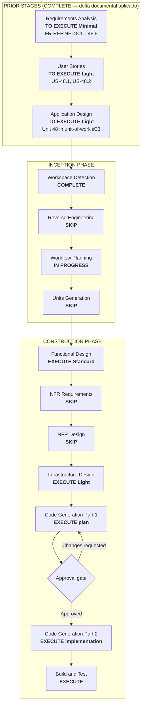

# Execution Plan — Unit 48: Predicciones con override por pool

## Status

- **Stage**: Workflow Planning — COMPLETE / Awaiting Approval
- **Unit**: Unit 48, refine post-construccion sobre Unit 5 (Predictions), Unit 6 (Scoring), Unit 3 (Pools), Unit 41 (Pool Predictions)
- **Created**: 2026-06-18
- **Design Decisions**: 5/5 captured (DD-48.1…DD-48.5)
- **Approval Gate**: Waiting for explicit approval before proceeding to Requirements Analysis

## Intent

El usuario quiere poder hacer predicciones con override por pool. El modelo actual (Units 1-47) solo soporta **una prediccion global por usuario y partido** (`UNIQUE(userId, matchId)`, BR-5.2: "la misma prediccion cuenta para cada pool"). El nuevo comportamiento es:

- La **prediccion global** (guardada desde `/matches`) sigue siendo la default y la que manda.
- Desde el contexto de un pool, el usuario puede opcionalmente **ajustar su prediccion** para ese pool especifico, creando un **override**.
- El override **reemplaza** la prediccion global solo dentro de ese pool (para vistas de predicciones, scoring del leaderboard, etc.).
- El ranking global sigue usando la prediccion global, sin afectar por los overrides.
- El leaderboard del pool prefiere el override si existe; si no hay override, cae a la prediccion global.
- Cada prediccion (global o override) tiene su propio `PredictionScore` (el motor `scoreMatch` sigue siendo idempotente y puntua todas las filas de `Prediction`).

## Design Decisions (Collected During Workflow Planning)

> Decisiones del usuario (AskUserQuestion, 2026-06-18) que refinan el alcance del Functional Design y Code Generation.

| ID | Pregunta | Respuesta | Implicacion |
|---|---|---|---|
| **DD-48.1** | Donde se crea/edita el override? | **Solo desde el pool** (`/pools/[id]`, tab Predicciones) | `savePrediction(..., poolId)` solo se invoca desde contexto de pool. `/matches` y `MatchCard` no cambian (siempre guardan global). |
| **DD-48.2** | Puede existir override sin global? | **Si, standalone** (SUPERSEDED por DD-48.2-revised, 2026-06-18) | Ver `inception/plans/unit-48-revised-dual-save-execution-plan.md`. El override ahora requiere global previa; dual-save UX ofrecida. |
| **DD-48.3** | Leaderboard distingue override vs global? | **Transparente** | `getPoolLeaderboard` resuelve override-vs-global internamente. El DTO `LeaderboardRow` no necesita nuevos campos. Los miembros solo ven puntos totales. |
| **DD-48.4** | Editar global invalida override? | **Independientes** | Editar una no toca la otra. Si el usuario quiere que el override refleje la nueva global, debe resetearlo manualmente. |
| **DD-48.5** | Como se resetea un override? | **Boton "Usar prediccion global"** | Nueva accion: `DELETE Prediction WHERE userId+matchId+poolId`. Solo visible si existe override + existe global. El boton aparece en la celda del usuario dentro de `PoolPredictionsView`. |

## Workspace Detection Summary

- Existing AI-DLC project detected (`aidlc-docs/aidlc-state.md`).
- Brownfield repository with Units 1-47 implementadas y verificadas (ultima: Unit 47, **342/342 tests**, `pnpm build` OK).
- Core workflow file (`.aidlc/aidlc-rules/aws-aidlc-rules/core-workflow.md`) present; following established AI-DLC workflow pattern.
- Reverse Engineering rerun is not needed: the impacted components (`Prediction` model, `savePrediction` action, `getPoolLeaderboard`, `getPoolMemberPredictions`, `getFixtureWithMyPredictions`, `scoreMatch`) are well understood from Units 5/6/41 artifacts.

## Scope / Impact Assessment

- **User-facing**: yes. Dos areas cambian (segun DD-48.1, DD-48.2, DD-48.5):
  1. Guardar/ajustar una prediccion desde un pool (`/pools/[id]`, tab "Predicciones") → override con `poolId`.
  2. Ver predicciones en el pool → preferir override si existe, sino mostrar la global. Boton "Usar prediccion global" para resetear.
  `/matches` sin cambios (siempre guarda predicciones globales).
- **Primary affected behavior**:
  - `Prediction` model: nueva columna `poolId` (nullable FK → Pool) + partial unique indexes (global: `UNIQUE(userId, matchId) WHERE poolId IS NULL`; override: `UNIQUE(userId, matchId, poolId) WHERE poolId IS NOT NULL`).
  - `savePrediction` server action: acepta `poolId` opcional; el upsert usa `userId + matchId + poolId` como llave compuesta.
  - `getFixtureWithMyPredictions` (Unit 5): sin cambios (siempre devuelve predicciones globales para `/matches`).
  - `getPoolMemberPredictions` (Unit 41): ampliado para resolver override-vs-global por miembro y match.
  - `getPoolLeaderboard` (Unit 6): ampliado para resolver override-vs-global en el calculo del total por miembro.
  - `PoolPredictionsView` (Unit 41): el usuario puede hacer click/tap en una celda para editar su prediccion desde el pool (override).
  - `scoreMatch` (Unit 6): sin cambios; puntua todas las filas de `Prediction` del partido (globales y overrides).
  - Global ranking: sigue usando solo predicciones con `poolId IS NULL`.
  - Cache invalidation (`revalidateResultViews`): extender tags para incluir leaderboards de pool.
- **Not affected**: auth, sync, admin, competition data, seed, onboarding, notifications (las notificaciones existentes de partido se disparan por el sweeper, que puntua todas las predicciones), eliminacion de cuenta, membresias, passkeys, web push.
- **Risk**: medium. Cambios:
  - Schema: 1 columna nueva + 2 partial unique indexes. Compatible hacia atras (las filas existentes tienen `poolId = NULL` y siguen funcionando como globales). La migracion es aditiva (no rompe datos existentes).
  - Logica: lectura/escritura de predicciones ahora distingue scope (global vs pool). El `savePrediction` acepta `poolId`; sin `poolId` → global (comportamiento actual, sin regresion).
  - Scoring: `scoreMatch` sin cambios (puntua por fila de `Prediction`, que ya es idempotente). El leaderboard de pool ahora debe resolver override vs global, lo que requiere query mas compleja.
  - UI: nuevas interacciones en `PoolPredictionsView` para editar predicciones desde el pool.
- **Files (planned for Code Gen Part 2)**:
  - NUEVO: `prisma/migrations/YYYYMMDDHHMMSS_unit48_prediction_pool_id/` (DDL).
  - MODIFICADO: `prisma/schema.prisma` (model Prediction: `poolId` + partial unique indexes).
  - MODIFICADO: `src/features/predictions/types.ts` (nuevo `SavePredictionInput` con `poolId`).
  - MODIFICADO: `src/features/predictions/schemas.ts` (input `poolId` opcional en Zod).
  - MODIFICADO: `src/features/predictions/actions/save-prediction.ts` (upsert por `userId+matchId+poolId`).
  - MODIFICADO: `src/features/predictions/queries.ts` (nueva `resolvePoolPredictions` helper).
  - MODIFICADO: `src/features/pools/queries.ts` (`getPoolMemberPredictions` ampliado para override-vs-global).
  - MODIFICADO: `src/features/scoring-rankings/queries.ts` (`getPoolLeaderboard` ampliado).
  - MODIFICADO: `src/features/pools/components/pool-predictions-view.tsx` (editabilidad desde pool context).
  - MODIFICADO: `src/features/pools/components/pool-predictions-view-helpers.ts` (transform adaptado a override).
  - MODIFICADO: `src/i18n/dictionaries/{es,en}.ts` (claves nuevas: `pools.predictions.saveOverride`, `pools.predictions.usingGlobalPrediction`).
  - NUEVO: tests para save-prediction con poolId, query de resolvedor, leaderboard con overrides.
  - MODIFICADO: tests existentes de save-prediction, pool-predictions, leaderboard.

## Stage Decisions

### Inception

- Workspace Detection: **COMPLETE**. Existing AI-DLC project resume.
- Reverse Engineering: **SKIP**. Artifacts existentes y codigo conocido son suficientes. Cambio aditivo y localizado sobre modelos/acciones de Units 5/6/41.
- Requirements Analysis: **EXECUTE (Minimal)** — nuevo delta documental. La intencion del usuario esta clara, pero requiere formalizacion en `requirements.md` como Epica 48.
- User Stories: **EXECUTE (Light)** — feature user-facing con nuevo comportamiento de prediccion por pool. Dos historias: US-48.1 (ajustar prediccion desde pool) y US-48.2 (ver predicciones de pool con overrides y fallback a global).
- Workflow Planning: **IN PROGRESS** (este documento).
- Application Design: **EXECUTE (Light)** — nueva Unit 48 en `unit-of-work.md` (secuencia #33) + dependency matrix actualizada + dependent designs anotados (Unit 5, Unit 6, Unit 41).
- Units Generation: **SKIP**. Single refine unit. No decomposition needed.

### Construction

- Functional Design: **EXECUTE (Standard)** — schema, nuevas reglas de negocio, modelo de dominio ampliado, resolucion de override, contratos de componentes y queries, plan de archivos, Security Baseline, verification plan. Es una unidad con logica de dominio real que justifica profundidad Standard (no Light).
- NFR Requirements: **SKIP**. Sin nuevos NFR de rendimiento/seguridad. La query de leaderboard con override es mas compleja pero acotada (<100 miembros). El indice partial mantiene uniqueness.
- NFR Design: **SKIP**.
- Infrastructure Design: **EXECUTE (Light)** — 1 columna nueva + 2 partial unique indexes + migracion Prisma. Sin triggers, RLS ni Storage.
- Code Generation Part 1: **EXECUTE** (post-FD approval).
- Code Generation Part 2: **EXECUTE** (post-Plan-1 approval).
- Build and Test: **EXECUTE**.

## Workflow Visualization

## Proposed Implementation Shape (For Later Code Generation)

### Schema: `Prediction.poolId` + Partial Unique Indexes

| Archivo | Cambio |
|---|---|
| `prisma/schema.prisma` | Anadir `poolId String? @map("pool_id")` al `model Prediction` + relacion `pool Pool? @relation(...)`. Reemplazar `@@unique([userId, matchId])` con partial unique indexes via `@@index` + raw SQL en la migracion. |
| `prisma/migrations/YYYYMMDDHHMMSS_unit48_prediction_pool_id/` (NUEVO) | `ALTER TABLE predictions ADD COLUMN pool_id UUID REFERENCES pools(id); CREATE UNIQUE INDEX predictions_user_match_global_uk ON predictions(user_id, match_id) WHERE pool_id IS NULL; CREATE UNIQUE INDEX predictions_user_match_pool_uk ON predictions(user_id, match_id, pool_id) WHERE pool_id IS NOT NULL;` |

### FR-REFINE-48.1/48.2: Guardar override desde pool + prediccion global sin cambios

| Archivo | Cambio |
|---|---|
| `src/features/predictions/schemas.ts` | `SavePredictionSchema` ampliado: `poolId: z.string().uuid().optional()`. |
| `src/features/predictions/types.ts` | `SavePredictionInput` ampliado con `poolId?: string`. |
| `src/features/predictions/actions/save-prediction.ts` | Upsert ahora usa `userId + matchId + (poolId ?? null)` como llave. Si `poolId` viene, validar que el usuario es miembro del pool (`PoolMembership.findUnique`). La validacion de membresia falla con error de dominio si no es miembro. |

### FR-REFINE-48.3/48.4: Lectura con resolucion override-vs-global

| Archivo | Cambio |
|---|---|
| `src/features/predictions/queries.ts` | Nueva funcion pura `resolvePoolPrediction(memberPredictions, matchId, poolId)` → devuelve la prediccion del pool si existe, sino la global, sino `null`. |
| `src/features/pools/queries.ts` | `getPoolMemberPredictions(poolId)` ampliado: ademas de predicciones con `poolId = <poolId>`, carga tambien predicciones globales (`poolId IS NULL`) de los miembros del pool. Aplica `resolvePoolPrediction` para cada (userId, matchId). Expone `isOverride: boolean` y `hasGlobal: boolean` en el DTO para que la UI sepa que esta mostrando override vs global. |

### FR-REFINE-48.5: Leaderboard con override-aware scoring

| Archivo | Cambio |
|---|---|
| `src/features/scoring-rankings/queries.ts` | `getPoolLeaderboard(poolId, viewerId)` modificado: para cada miembro, calcula el total seleccionando scores de predicciones con `poolId = <poolId>` mas scores de predicciones globales (`poolId IS NULL`) **excluyendo** matches donde ya existe un override del pool. La query usa `NOT EXISTS (SELECT 1 FROM Prediction p2 WHERE p2.userId = p1.userId AND p2.matchId = p1.matchId AND p2.poolId = <poolId>)` para evitar doble conteo. |

### FR-REFINE-48.6: UI para guardar override desde el pool

| Archivo | Cambio |
|---|---|
| `src/features/pools/components/pool-predictions-view.tsx` | Nueva interaccion: la celda de prediccion del usuario actual es editable (si el partido esta SCHEDULED y antes de kickoff). Al hacer click → modal/inline con `PredictionScoreControls` + `PenaltyWinnerSelector`. Al guardar → `savePrediction({ ..., poolId })`. |
| `src/features/pools/components/pool-predictions-view-helpers.ts` | `buildDayGroups` y `buildMemberRows` ampliados para marcar `isOverride` y `hasGlobal` en las celdas. |
| `src/i18n/dictionaries/{es,en}.ts` | Nuevas claves: `pools.predictions.saveOverride` ("Guardar prediccion para esta liga"), `pools.predictions.usingGlobalPrediction` ("Usando tu prediccion global"), `pools.predictions.editInPool` ("Ajustar para esta liga"). |

### FR-REFINE-48.7/48.8: Global ranking + cache

| Archivo | Cambio |
|---|---|
| `src/features/scoring-rankings/queries.ts` | `getGlobalRankingRows` sin cambios funcionales (filtra implicitamente `poolId IS NULL` porque las predicciones globales son las unicas que no tienen poolId). Anadir filtro explicito `WHERE poolId IS NULL` para claridad y defensa. |
| (varios) | `revalidateResultViews` extiende tags para incluir leaderboards de pool afectados (si un miembro edito un override, invalidar el leaderboard de ese pool). |

### Sin cambios

| Archivo | Razon |
|---|---|
| `src/features/predictions/services/eligibility.ts` | La logica de lock por kickoff aplica igual a globales y overrides. |
| `src/features/predictions/services/validation.ts` | Validacion de scores y penalty winner sin cambios. |
| `src/features/competition/services/sync-orchestrator.ts` | No toca predicciones. |
| `src/features/scoring-rankings/services/score-match.ts` | `scoreMatch` sigue puntuando todas las filas de `Prediction` del partido (globales + overrides). Sin cambios. |
| `src/features/scoring-rankings/services/score-sweeper.ts` | Barredor sin cambios. |
| `src/features/admin/` | Sin cambios en admin (force-result, revert-override, trigger-sync). |
| `src/features/auth/`, `src/features/profile/`, `src/features/notifications/` | No afectados. |
| `src/app/(app)/matches/page.tsx` | Siempre usa predicciones globales. Sin cambios. |

## Verification Plan

- Schema: migracion aplica sin errores; `poolId` nullable con FK a `pools`.
- Partial unique indexes: intentar insertar dos globales para mismo (userId, matchId) → error. Insertar global + override para mismo match en diferente pool → OK. Insertar dos overrides para mismo pool+user+match → error.
- `savePrediction` con `poolId`:
  - Usuario miembro del pool guarda override → upsert exitoso.
  - Usuario NO miembro del pool intenta guardar override → error de membresia.
  - Usuario guarda sin `poolId` → global (regresion: mismo comportamiento que antes).
  - Usuario guarda global existente con override → ambas filas coexisten.
- `resolvePoolPrediction`:
  - Si existe override → devuelve override.
  - Si no existe override pero existe global → devuelve global.
  - Si no existe ninguna → devuelve null.
- `getPoolLeaderboard` con overrides:
  - Miembro con override en match M → suma puntos del override para M, globales para el resto.
  - Miembro sin overrides → suma puntos de todas sus globales (regresion: mismo comportamiento que antes).
  - Miembro con override que anula global → no hay doble conteo.
- `getPoolMemberPredictions`:
  - Expone `isOverride: true` cuando se muestra un override.
  - Expone `hasGlobal: true` cuando existe prediccion global para ese match (ademas del override).
- Global ranking: filtra por `poolId IS NULL`. Un usuario con 100 puntos globales + 50 en overrides → ranking muestra 100.
- `pool-predictions-view`: celdas del usuario actual son editables si el partido es SCHEDULED antes de kickoff. Al guardar → se refleja el override. Badge/hint "Ajustada para esta liga".
- Cache: al guardar un override, se invalida el leaderboard del pool (tag especifico `pool-leaderboard-{poolId}`).
- Regresion: `savePrediction` sin `poolId` funciona igual que antes. `getFixtureWithMyPredictions` en `/matches` sin cambios. Tests existentes de save-prediction, eligibilidad, lock, scoring intactos.
- `pnpm exec tsc --noEmit`.
- Biome/ESLint en archivos tocados.
- Focused Vitest; full suite.

## Security Baseline Compliance

- SECURITY-01: N/A. Sin cambios en autenticacion. `getOnboardedUserId()` se exige.
- SECURITY-02: N/A. Sin datos de pago ni crypto.
- SECURITY-03: N/A. Sin secrets, keys ni env vars nuevas.
- SECURITY-04: N/A. Sin cambios en CSP ni scripts inline.
- SECURITY-05: **COMPLIANT**. Input validado con Zod en `savePrediction` (`poolId` opcional, validado como UUID si presente). Server action es fuente de verdad.
- SECURITY-06: N/A. Sin operaciones criptograficas.
- SECURITY-07: N/A. Sin rate limiting requerido (mismo patron de `savePrediction` existente).
- SECURITY-08: **COMPLIANT**. Validacion de membresia server-side en `savePrediction` cuando `poolId` esta presente (previene IDOR: usuario no miembro no puede guardar override en pool ajeno). La validacion de lock (kickoff) aplica igual.
- SECURITY-09: N/A. Sin cambios en `logAuthEvent`.
- SECURITY-10: N/A. Sin dependencias npm nuevas.
- SECURITY-11: N/A. Sin cambios en session management.
- SECURITY-12: N/A. Los payloads de push no cambian.
- SECURITY-13: N/A. Sin cambios en CSRF.
- SECURITY-14: N/A. Sin data exports.
- SECURITY-15: N/A. Sin cambios en backup/recovery.

## Artifact Changes After Approval

| Artifact | Planned change |
|---|---|
| `aidlc-state.md` | Marcar Workflow Planning COMPLETE; actualizar Current Stage → Unit 48 DELTA DOCUMENTAL; anadir bloque Unit 48 en Stage Progress |
| `audit.md` | Entrada de auditoria para Workflow Planning |
| `inception/requirements/requirements.md` | Anadir Epica 48 con FR-REFINE-48.1…48.8 |
| `inception/user-stories/stories.md` | Anadir Epica 48 con US-48.1 y US-48.2 |
| `inception/application-design/unit-of-work.md` | Anadir Unit 48 con secuencia #33 |
| `inception/application-design/unit-of-work-dependency.md` | Anadir Unit 48 row (depende de Units 3, 5, 6, 41) |
| Unit 5 `functional-design/business-rules.md` | Supersede BR-5.2, BR-5.3 para soporte de override; anadir BR-5.38…5.42 |
| Unit 5 `functional-design/domain-entities.md` | Anadir `poolId` y partial unique indexes |
| Unit 5 `functional-design/business-logic-model.md` | Anadir BL-5.7 (save con scope) y BL-5.8 (resolucion override-vs-global) |
| Unit 6 `functional-design/business-rules.md` | Supersede BR-6.11 para pool-scoped totals; anadir BR-6.23…6.26 |
| Unit 6 `functional-design/business-logic-model.md` | Actualizar BL-5 (leaderboard override-aware) |
| Unit 41 `functional-design.md` | Anadir nota sobre predicciones scoped-by-pool y editabilidad |
| `construction/unit-48-pool-prediction-override/functional-design.md` (NUEVO, tras approval) | Functional Design Standard con domain entities, business rules, contratos, plan de archivos, Security Baseline, verification plan |
| Application code (workspace root, post FD+CG) | Schema Prisma + migracion; `schemas.ts`, `types.ts`, `save-prediction.ts`, `queries.ts` (predictions + pools + scoring-rankings), `pool-predictions-view.tsx`, `pool-predictions-view-helpers.ts`, i18n, tests |

## Approval Gate

Workflow Planning awaiting explicit approval. Do not proceed to Requirements Analysis until approval is received.

---

## Workflow Planning Complete

I've created a comprehensive execution plan based on:
- Your request: Pool-specific prediction overrides — global prediction as default, optional per-pool adjustment ("override").
- Existing system: Brownfield Units 1-47 implementadas y verificadas (342/342 tests).
- Impacted designs: Unit 5 (Predictions model + save action), Unit 6 (Scoring/leaderboard), Unit 41 (Pool predictions view).

**Detailed Analysis**:
- Risk level: medium (schema change + scoring logic + UI). Backward-compatible: `poolId` defaults to NULL; existing global predictions work unchanged. No data migration needed.
- Impact: 1 nueva columna + 2 partial indexes en `Prediction`; cambios en `savePrediction`, `getPoolLeaderboard`, `getPoolMemberPredictions`, `PoolPredictionsView`; sin cambios en sync, admin, auth, match-locking engine, scoring engine.
- Dependencies: Unit 3 (membership validation), Unit 5 (prediction model), Unit 6 (scoring/leaderboard), Unit 41 (pool predictions view).

**Recommended Execution Plan**:

I recommend executing **6** stages (Requirements Minimal → Stories Light → App Design Light → Functional Design Standard → Code Gen Part 1/2 → Build & Test):

🔵 **INCEPTION PHASE:**
1. Workspace Detection — *COMPLETE* (existing project resume)
2. Reverse Engineering — *SKIP* (artifacts existentes son suficientes)
3. **Requirements Analysis — *EXECUTE Minimal*** (nuevo delta Epica 48)
4. **User Stories — *EXECUTE Light*** (US-48.1, US-48.2)
5. **Application Design — *EXECUTE Light*** (Unit 48 en unit-of-work + dependencies)
6. Units Generation — *SKIP* (single unit)
7. **Workflow Planning — *IN PROGRESS*** (este plan)

🟢 **CONSTRUCTION PHASE:**
8. **Functional Design (Standard)** — *EXECUTE*
9. NFR Requirements / NFR Design — *SKIP* (sin nuevos NFR)
10. **Infrastructure Design (Light)** — *EXECUTE* (schema migration)
11. **Code Generation Part 1** — *EXECUTE plan* (post-FD+Infra approval)
12. **Code Generation Part 2** — *EXECUTE implementation* (post-Plan-1 approval)
13. **Build and Test** — *EXECUTE*

**Estimated Timeline**: 6 stages x 1 interaction each ≈ 6 iterations.

> **📋 <u>REVIEW REQUIRED:</u>**
> Please examine the execution plan at: `aidlc-docs/inception/plans/unit-48-pool-prediction-override-execution-plan.md`

> **🚀 <u>WHAT'S NEXT?</u>**
>
> You may:
>
> 🔧 **Request Changes** - Ask for modifications to the execution plan if required
> 📝 **Add Skipped Stages** - Choose to include stages currently marked as SKIP (RE, NFR, Infra)
> ✅ **Approve & Continue** - Approve plan and proceed to **Requirements Analysis (Minimal)**
