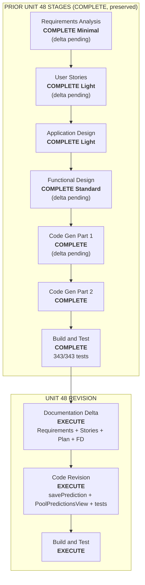

# Execution Plan — Unit 48 Revised: No standalone override, dual-save UX

## Status

- **Stage**: Workflow Planning — IN PROGRESS / Awaiting Approval
- **Unit**: Unit 48 (revision), refine sobre el Functional Design y Code Generation ya completados
- **Created**: 2026-06-18
- **Approval Gate**: Waiting for explicit approval before document deltas and code revision

## Intent

El usuario clarifico el diseno de Unit 48 tras la implementacion inicial:

1. **DD-48.2 REVERSED**: No se permite crear un override sin prediccion global previa. Si el usuario intenta guardar desde un pool y no tiene global, se le ofrece guardar el mismo resultado como global tambien (**dual-save UX**).
2. **Nada fue deployado**: El codigo de Unit 48 nunca se commiteo, pusheo ni migro. Se puede revisar todo como una unidad fresca.
3. **Clarificacion de ranking**: El ranking global SOLO cuenta predicciones globales (`poolId IS NULL`). El leaderboard del pool usa override o global, pero esos puntos nunca suben al ranking global.

## Workspace Detection Summary

- Existing AI-DLC project. Unit 48 BUILD AND TEST COMPLETE (343/343 tests, build OK).
- La implementacion existe localmente pero no en produccion. Schema, migracion y codigo son modificables.
- El cambio es un **refine sobre Unit 48** — no requiere nuevo numero de unidad ni reiniciar etapas de Units 1-47 ni las etapas de inception de Unit 48 (Requirements, Stories, App Design ya validas con deltas minimos).

## Design Decisions (Revised)

> DD-48.2 original (standalone override) queda **superseded**.

| ID | Pregunta | Respuesta | Implicacion |
|---|---|---|---|
| **DD-48.2-revised** | Puede existir override sin global? | **No. El usuario debe tener global primero.** Al guardar desde pool sin global → dialogo ofreciendo guardar como global tambien. | `savePrediction` acepta `poolId` y opcionalmente `alsoSaveAsGlobal`. Dialoogo con dos botones: "Guardar como global tambien" y "Solo para esta liga" (cancela con mensaje). |
| **DD-48.1** | Donde se crea/edita el override? | Solo desde el pool (sin cambios) | Sin cambios. |
| **DD-48.3** | Leaderboard transparente? | Si (sin cambios) | Sin cambios. |
| **DD-48.4** | Global y override independientes? | Si (sin cambios) | Sin cambios. |
| **DD-48.5** | Boton reset override? | Si (sin cambios) | Sin cambios. |

## Scope / Impact Assessment

- **Cambios documentales (aidlc-docs/)**:
  - `requirements.md` FR-REFINE-48.2: "standalone" → "dual-save UX with dialog"
  - `stories.md` US-48.1 AC: replace standalone AC with dual-save dialog AC
  - `inception/plans/unit-48-pool-prediction-override-execution-plan.md` DD-48.2: mark superseded, add DD-48.2-revised
  - `construction/unit-48-pool-prediction-override/functional-design.md`: update BR-48.2, BL-48.1, component contracts
  - `construction/plans/unit-48-pool-prediction-override-code-generation-plan.md`: add step for dual-save

- **Cambios de codigo (workspace root)**:
  - `src/features/predictions/actions/save-prediction.ts`: quitar error standalone; aceptar `alsoSaveAsGlobal?: boolean`; si `true` → crear global + override en una transaccion
  - `src/features/pools/components/pool-predictions-view.tsx`: reemplazar editor inline standalone con dialogo de dos botones
  - Tests: actualizar save-prediction (caso standalone → dual-save), pool-predictions-view (dialogo)

- **No afecta**: schema, migracion, queries de leaderboard/ranking, reset override, i18n (claves existentes reutilizadas), cache tags, page.tsx. Todo lo demas de Unit 48 sigue igual.

- **Risk**: low. El cambio es aditivo sobre el codigo ya verificado. Solo se modifica el flujo de guardado standalone → dual-save.

## Stage Decisions

### Inception

- Workspace Detection: **COMPLETE** (existing project resume).
- Reverse Engineering: **SKIP**.
- Requirements Analysis: **SKIP formal / delta minimo** — solo actualizar FR-REFINE-48.2. No nuevos requerimientos.
- User Stories: **SKIP formal / delta minimo** — solo actualizar AC de US-48.1. No nuevas historias.
- Workflow Planning: **IN PROGRESS** (este documento).
- Application Design: **SKIP** — Unit 48 ya esta en unit-of-work.md.
- Units Generation: **SKIP**.

### Construction

- Functional Design: **EXECUTE (Light delta)** — actualizar BR-48.2, BL-48.1, contratos de componente en el functional-design.md existente.
- NFR Requirements / NFR Design: **SKIP**.
- Infrastructure: **SKIP** (schema y migracion sin cambios).
- Code Generation Part 1: **EXECUTE (Mini plan)** — plan de 5 pasos para la revision.
- Code Generation Part 2: **EXECUTE** — modificar savePrediction + PoolPredictionsView + tests.
- Build and Test: **EXECUTE** — re-verificar.

## Workflow Visualization



## Proposed Implementation Shape

### Documentation deltas (Step 1)

| Archivo | Cambio |
|---|---|
| `requirements.md` FR-REFINE-48.2 | "Standalone" → "El usuario puede guardar su prediccion como global al mismo tiempo que crea el override si no existe global previa. Dialogo: 'Guardar como global tambien' o 'Solo para esta liga'." |
| `stories.md` US-48.1 | AC: "Si no tiene prediccion global, se le ofrece guardar el resultado tambien como global" |
| `execution-plan.md` | DD-48.2 marked superseded, DD-48.2-revised added |
| `functional-design.md` | BR-48.2 revised, BL-48.1 revised with dual-save logic, PoolPredictionsView contract updated |

### Code revision (Step 2)

**`savePrediction` revision**:

```ts
// Nueva logica: si poolId presente y no hay global para este match
// y el caller paso alsoSaveAsGlobal: true, crear ambas filas
export async function savePrediction(input: {
  matchId: string;
  homeScore: number;
  awayScore: number;
  penaltyWinnerTeamId: string | null;
  poolId?: string;
  alsoSaveAsGlobal?: boolean;
}): Promise<{ success: true } | { error: string }> {
  // ... validaciones existentes ...

  if (poolId) {
    // validar membresia (ya existe)
    // Si alsoSaveAsGlobal: crear global + override en secuencia
    if (input.alsoSaveAsGlobal) {
      // upsert global (poolId: null)
      // upsert override (poolId: poolId)
      // Si ya existe global → solo crear/actualizar override (sin cambios)
    }
  }
}
```

**`PoolPredictionsView` revision**:

Cuando el viewer hace click en "Guardar para esta liga" y NO tiene global para ese match:
- Mostrar mini-dialogo con dos botones (en vez del editor inline actual):
  - "Guardar como global tambien" → llama `savePrediction({ ..., poolId, alsoSaveAsGlobal: true })`
  - "Solo para esta liga" → toast "Primero guarda tu prediccion global en /partidos"
- Si YA tiene global → comportamiento actual (editor inline, guarda override)

### Files modified (code)

| Archivo | Cambio |
|---|---|
| `src/features/predictions/actions/save-prediction.ts` | `alsoSaveAsGlobal` param, logica dual-save |
| `src/features/pools/components/pool-predictions-view.tsx` | Reemplazar standalone editor con dialogo de 2 botones |
| `src/features/predictions/actions/__tests__/save-prediction.test.ts` | Caso standalone → caso dual-save |
| `src/features/pools/components/__tests__/pool-predictions-view.test.tsx` | Caso dialogo |

### Sin cambios

- `prisma/schema.prisma` — modelo y migracion intactos
- `src/features/predictions/queries.ts` — `resolvePoolPredictions` intacto
- `src/features/pools/queries.ts` — `getPoolMemberPredictions` intacto
- `src/features/scoring-rankings/queries.ts` — leaderboard y ranking intactos
- `src/features/predictions/actions/reset-prediction-override.ts` — intacto
- `src/features/predictions/services/lock.ts` — intacto
- i18n — claves existentes reutilizadas

## Verification Plan

- `savePrediction` con `poolId` + `alsoSaveAsGlobal: true` y sin global previa:
  - Crea fila global (poolId: null) + fila override (poolId: poolId).
  - Ambas con los mismos scores.
- `savePrediction` con `poolId` + `alsoSaveAsGlobal: true` y global YA existe:
  - Solo crea/actualiza el override (no duplica la global).
- `savePrediction` con `poolId` sin `alsoSaveAsGlobal` y sin global:
  - Comportamiento actual (en el flujo UI, esto nunca se llama — el dialogo lo previene).
- `PoolPredictionsView`: sin global → dialogo 2 botones visible. Con global → editor inline normal.
- Boton "Solo para esta liga" → toast de advertencia.
- Boton "Guardar como global tambien" → toast de exito + router.refresh.
- Regresion: `savePrediction` sin `poolId` funciona igual que antes.
- `pnpm exec tsc --noEmit`, Biome, ESLint, full Vitest, build.

## Artifact Changes After Approval

| Artifact | Planned change |
|---|---|
| `aidlc-state.md` | Marcar Workflow Planning COMPLETE; Current Stage → Unit 48 REVISION; bloques de delta |
| `audit.md` | Entrada de auditoria para Workflow Planning |
| `inception/plans/unit-48-revised-dual-save-execution-plan.md` | Este documento |
| `inception/requirements/requirements.md` | Actualizar FR-REFINE-48.2 |
| `inception/user-stories/stories.md` | Actualizar US-48.1 ACs |
| `inception/plans/unit-48-pool-prediction-override-execution-plan.md` | DD-48.2 superseded |
| `construction/unit-48-pool-prediction-override/functional-design.md` | BR-48.2, BL-48.1, componente |
| Codigo (workspace root) | `save-prediction.ts`, `pool-predictions-view.tsx`, tests |

## Approval Gate

Workflow Planning awaiting explicit approval. Do not proceed until approval is received.

---

## Workflow Planning Complete

Revision plan for Unit 48 based on design clarification:
- **DD-48.2 reversed**: no standalone override, dual-save UX instead
- **2 stages**: Documentation deltas (5 files) + Code revision (4 files)
- **Risk: low** — additive change on already-verified code
- **Nothing deployed** — free to revise without migration concern

> **REVIEW REQUIRED:**
> Please examine the plan at: `aidlc-docs/inception/plans/unit-48-revised-dual-save-execution-plan.md`

> **WHAT'S NEXT?**
>
> **Request Changes** — Modify the revision plan
> **Approve & Continue** — Proceed to **Documentation deltas + Code revision**
