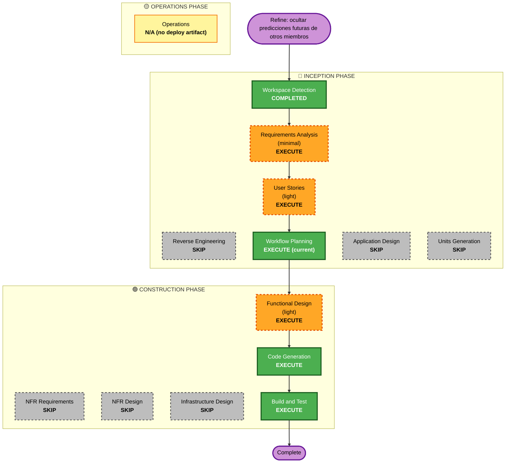

# Execution Plan — Unit 53: Ocultar predicciones futuras de otros miembros (anti-sesgo)

> **Estado: ✅ APROBADO (2026-06-20)** — el usuario aprobó este plan tal cual. Stages EXECUTE = COMPLETE; Unit 53 cerrada en Construction. Commit/push pendientes de petición explícita.

> **Nota de transparencia (2026-06-20)**: este plan se produce vía `/aidlc:plan` **después** de que el cambio fuera implementado y verificado vía `/aidlc:refine` en la interacción previa. Es **retrospectivo**: codifica las decisiones de stage/depth que se tomaron, da al usuario el control de revisión que el flujo exige, y deja abierta la opción de pedir cambios o revertir (nada está commiteado ni pusheado). Los stages marcados EXECUTE ya se ejecutaron; su estado real es COMPLETE pendiente de aprobación de este plan.

## Detailed Analysis Summary

### Transformation Scope (Brownfield)
- **Transformation Type**: Single-component change (read-path de una sola feature).
- **Primary Changes**: Enmascarado server-side de predicciones de otros miembros para partidos no iniciados en la pestaña "Predicciones" de `/pools/[id]`.
- **Related Components**: `features/pools` (query + tipos + componente de vista), `i18n/dictionaries`. Ninguno fuera de esa frontera.

### Change Impact Assessment
- **User-facing changes**: Sí — otros miembros ya no ven tus predicciones futuras; aparece un candado "Oculta hasta el inicio".
- **Structural changes**: No — sin nuevos componentes, servicios ni rutas.
- **Data model changes**: No — sin schema, migraciones ni columnas; el campo `hidden` es un DTO calculado en memoria, no persistido.
- **API changes**: No — sin nuevas rutas ni server actions; firma de `getPoolMemberPredictions` sin cambios (solo se enmascara contenido del DTO existente).
- **NFR impact**: Seguridad (positivo) — refuerza confidencialidad (SECURITY-13). Sin impacto de performance (mismo número de queries; un cálculo O(1) por fila).

### Component Relationships
- **Primary Component**: `src/features/pools` (`queries.ts`, `types.ts`, `components/pool-predictions-view*.tsx`).
- **Shared Components**: `src/i18n/dictionaries/{es,en}.ts` (1 clave nueva).
- **Dependent Components**: `src/app/(app)/pools/[id]/page.tsx` consume la query — sin cambios (ya pasa `viewerId`).
- **Upstream afectados conceptualmente**: Unit 41 (BR-41.2, garantía original restaurada), Unit 48 (BR-48.16, acotada).
- **Change Type / Priority**: Minor / Important (corrige una regresión de confidencialidad).

### Risk Assessment
- **Risk Level**: **Low** — cambio aislado en el read-path de una feature, con tests; sin schema/migración/ruta.
- **Rollback Complexity**: **Easy** — revertir el diff (sin commit aún); sin estado persistido que deshacer.
- **Testing Complexity**: **Simple** — 2 tests de query unitarios + factory de componente.

## Workflow Visualization

## Phases to Execute

### 🔵 INCEPTION PHASE
- [x] Workspace Detection (COMPLETED — baseline brownfield existente)
- [x] Reverse Engineering — SKIP
  - **Rationale**: Artefactos de RE ya existen (rerun 2026-06-17); sin cambio arquitectónico.
- [x] Requirements Analysis — EXECUTE (minimal)
  - **Rationale**: Intent claro y acotado; se documentó FR-REFINE-53.1 (Épica 53). Sin preguntas de clarificación necesarias.
- [x] User Stories — EXECUTE (light)
  - **Rationale**: Cambio user-facing en un flujo de usuario (visibilidad entre pares); US-53.1 captura el criterio anti-sesgo.
- [x] Workflow Planning — EXECUTE (esta etapa)
- [x] Application Design — SKIP
  - **Rationale**: Sin componentes, servicios ni métodos nuevos; cambio dentro de las fronteras de `features/pools` existentes.
- [x] Units Generation — SKIP
  - **Rationale**: Sin descomposición nueva; es un delta sobre Units 41/48 ya generadas (registrado en `unit-of-work.md` #37).

### 🟢 CONSTRUCTION PHASE
- [x] Functional Design — EXECUTE (light)
  - **Rationale**: Regla de negocio de visibilidad nueva (BR-53.1…53.4); diseño en `construction/unit-53-pool-predictions-hide-future/functional-design.md`.
- [x] NFR Requirements — SKIP
  - **Rationale**: Sin nuevos requisitos de performance/escalabilidad; stack determinado. La seguridad se cubre con el Security Baseline dentro del FD.
- [x] NFR Design — SKIP
  - **Rationale**: NFR Requirements omitido.
- [x] Infrastructure Design — SKIP
  - **Rationale**: Sin cambios de infraestructura, deploy ni recursos cloud.
- [x] Code Generation — EXECUTE
  - **Rationale**: Implementado el enmascarado server-side + tipos + UI + i18n + 2 tests.
- [x] Build and Test — EXECUTE
  - **Rationale**: Verificación ejecutada (ver Quality Gates).

### 🟡 OPERATIONS PHASE
- [ ] Operations — N/A
  - **Rationale**: Sin schema, migración ni config de entorno; despliega con el push normal de la app, sin paso operativo dedicado.

## Estimated Timeline
- **Total stages EXECUTE**: 6 (RA, US, WP, FD, CG, BT). **SKIP**: 6.
- **Estimated Duration**: ~1 sesión (ya completada).

## Success Criteria
- **Primary Goal**: En la pestaña "Predicciones" del pool, ningún miembro ve las predicciones **futuras** de otros (anti-sesgo); el viewer sigue viendo/editando las propias.
- **Key Deliverables**: enmascarado en `getPoolMemberPredictions`; campo DTO `hidden`; indicador de candado i18n; tests.
- **Quality Gates** (verificados): `tsc --noEmit` 0 · Biome limpio (8 archivos) · ESLint 0 (1 warning preexistente de ``) · **Vitest 379/379** (+2 tests).
- **Rollback**: revertir el diff del working tree (sin commit), sin estado persistido.
