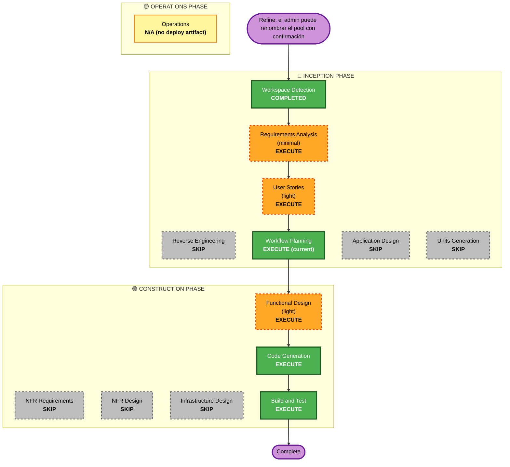

# Execution Plan — Unit 54: Renombrar pool con confirmación

> **Estado: ✅ APROBADO (2026-06-20)** — el usuario aprobó este plan **antes** de ejecutar (presentado en plan mode, con decisiones confirmadas vía AskUserQuestion: alcance = todas las ligas, PUBLIC y PRIVATE; confirmación = modal `«viejo» → «nuevo»`). No es retrospectivo. Stages EXECUTE = COMPLETE; Unit 54 cerrada en Construction. Commit/push pendientes de petición explícita.

## Detailed Analysis Summary

### Transformation Scope (Brownfield)
- **Transformation Type**: Feature aditiva sobre una sola frontera (`features/pools`): nueva server action + sección de UI con confirmación.
- **Primary Changes**: El admin (dueño) puede renombrar su liga (PUBLIC o PRIVATE) desde el panel de Configuración, con un diálogo de confirmación previo.
- **Related Components**: `features/pools` (schema, action, componentes del settings card), `app/(app)/pools/[id]/page.tsx` (gate del card), `i18n/dictionaries`. Ninguno fuera de esa frontera.

### Change Impact Assessment
- **User-facing changes**: Sí — el dueño ve un campo de nombre + botón "Cambiar nombre" y un modal de confirmación; el nombre nuevo se refleja en `/pools` y `/pools/[id]`.
- **Structural changes**: No — sin nuevos componentes de dominio, servicios ni rutas (la action vive en el patrón existente de `features/pools/actions`).
- **Data model changes**: No — `Pool.name` ya existe (`@db.VarChar(60)`); sin schema ni migraciones.
- **API changes**: Nueva server action `renamePool` (mismo patrón que `updatePoolMembersCanInvite`); sin rutas HTTP nuevas.
- **NFR impact**: Seguridad — autorización por `ownerId` server-side (SECURITY-08), input validado por Zod (SECURITY-01). Sin impacto de performance.

### Component Relationships
- **Primary Component**: `src/features/pools` (`schemas.ts`, `actions/rename-pool.ts`, `components/pool-settings-card{,-client}.tsx`).
- **Shared Components**: `src/i18n/dictionaries/{es,en}.ts` (claves `settings.rename*`).
- **Dependent Components**: `src/app/(app)/pools/[id]/page.tsx` — abre el gate del `PoolSettingsCard` de `isOwner && PRIVATE` a `isOwner` y pasa `poolType`/`initialName`.
- **Upstream reusado**: Unit 3 (entidad `Pool`, `ownerId`, BR-3.2 unicidad PUBLIC), Unit 45 (panel Configuración), `create-pool.ts` (pre-check de unicidad), `confirm-delete-modal.tsx` (patrón de diálogo).
- **Change Type / Priority**: Minor / Important (capacidad de gestión que faltaba).

### Risk Assessment
- **Risk Level**: **Low** — feature aislada con autorización reusada y tests; sin schema/migración/ruta.
- **Rollback Complexity**: **Easy** — revertir el diff (sin commit aún); sin estado persistido que deshacer.
- **Testing Complexity**: **Simple** — tests unitarios de la action (auth, validación, owner/no-owner, PUBLIC/PRIVATE, unicidad/colisión) + tests de UI del card.

## Workflow Visualization

## Phases to Execute

### 🔵 INCEPTION PHASE
- [x] Workspace Detection (COMPLETED — baseline brownfield existente)
- [x] Reverse Engineering — SKIP
  - **Rationale**: Artefactos de RE ya existen; sin cambio arquitectónico.
- [x] Requirements Analysis — EXECUTE (minimal)
  - **Rationale**: Intent claro y acotado; se documentó Épica 54 / FR-REFINE-54.1–3. Decisiones de alcance/confirmación resueltas con el usuario.
- [x] User Stories — EXECUTE (light)
  - **Rationale**: Cambio user-facing en un flujo de admin; US-54.1 captura el criterio (confirmación, validación, alcance, solo dueño).
- [x] Workflow Planning — EXECUTE (esta etapa)
- [x] Application Design — SKIP
  - **Rationale**: Sin componentes/servicios/métodos nuevos de dominio; reusa el patrón de `updatePoolMembersCanInvite` y el diálogo de `confirm-delete-modal`.
- [x] Units Generation — SKIP
  - **Rationale**: Delta sobre Units 3/45 ya generadas (registrado en `unit-of-work.md` Unit 54 + #38).

### 🟢 CONSTRUCTION PHASE
- [x] Functional Design — EXECUTE (light)
  - **Rationale**: Reglas nuevas BR-54.1…54.6 + BL-54.1; diseño en `construction/unit-54-pool-rename/functional-design.md`.
- [x] NFR Requirements — SKIP
  - **Rationale**: Sin nuevos requisitos de performance/escalabilidad; seguridad cubierta por el Security Baseline del FD.
- [x] NFR Design — SKIP
  - **Rationale**: NFR Requirements omitido.
- [x] Infrastructure Design — SKIP
  - **Rationale**: Sin cambios de infraestructura, deploy ni recursos cloud (`Pool.name` ya existe).
- [x] Code Generation — EXECUTE
  - **Rationale**: `RenamePoolSchema`, `renamePool` (con unicidad PUBLIC, BR-54.6), UI del card + diálogo de confirmación, gate de `page.tsx`, i18n, tests.
- [x] Build and Test — EXECUTE
  - **Rationale**: Verificación ejecutada (ver Quality Gates).

### 🟡 OPERATIONS PHASE
- [ ] Operations — N/A
  - **Rationale**: Sin schema, migración ni config de entorno; despliega con el push normal de la app.

## Estimated Timeline
- **Total stages EXECUTE**: 6 (RA, US, WP, FD, CG, BT). **SKIP**: 6.
- **Estimated Duration**: ~1 sesión (ya completada).

## Success Criteria
- **Primary Goal**: El dueño de cualquier liga (PUBLIC o PRIVATE) puede renombrarla con una confirmación previa; el nombre nuevo se refleja en `/pools` y `/pools/[id]`.
- **Key Deliverables**: `renamePool` (auth por `ownerId`, validación 3–60, unicidad PUBLIC BR-54.6); sección de rename + diálogo `«viejo» → «nuevo»`; gate del card abierto a `isOwner`; i18n es/en; tests de action y UI.
- **Quality Gates** (verificados): `tsc --noEmit` 0 · Biome limpio · **Vitest** verde en las suites tocadas (`rename-pool` 12/12, `pool-settings-card` 7/7) y suite completa sin regresiones (el único archivo que falla, `run-scheduled-sync`, es pre-existente por `DATABASE_URL` ausente).
- **Rollback**: revertir el diff del working tree (sin commit), sin estado persistido.
