# Execution Plan — Unit 62: Proyección de leaderboard en vivo

> Refine post-construcción (2026-06-23). **Plan presentado y aprobado** ("Aprobar y continua"). Refine sobre Units 6/55/57/58. **No reinicia** etapas aprobadas (Units 1–61 intactas; Unit 61 queda como plan pendiente no implementado — Unit 62 se construye sobre el estado actual del repo, independiente).

## Detailed Analysis Summary

### Transformation Scope (Brownfield)
- **Transformation Type**: Single component change (aditivo en `features/scoring-rankings`)
- **Primary Changes**: nuevo servicio de proyección puro + tipo `ProjectedLeaderboardRow`; variante de queries con proyección (no cacheada en la capa projection); modo "proyección" en `PoolLeaderboard`;łączenie `useLiveResults()` en `/rankings` y `/pools/[id]` (tab Clasificación y `/pools/[id]/leaderboard`).
- **Related Components**: `computeScore` (shared puro, sin cambios), `toScoringExample`/`ScoreableMatch` (score-adapter, reusado), `useLiveResults` (Unit 58, reusado).

### Change Impact Assessment
- **User-facing**: Sí — leaderboards re-ordenados por proyectado, pts `actual → proyectado`, badge "proy.", cambio posición (▲/▼)
- **Structural**: No — aditivo, sin nuevas rutas/actions
- **Data model**: No — sin schema/migraciones; `PredictionScore` para LIVE **no** se persiste (respeta BR-41.5/BR-61.5)
- **API changes**: No
- **NFR impact**: Perf (medio) — la proyección es una query ligera fresca sólo cuando hay LIVE; no invalida `unstable_cache` (`RANKINGS_TAG`/`POOL_LEADERBOARD_TAG_PREFIX`); se calcula al vuelo por render

### Component Relationships (Brownfield)
- **Primary Component**: `src/features/scoring-rankings/`
- **Shared Components**: `src/features/scoring/compute-score.ts` (puro), `src/features/scoring-rankings/services/score-adapter.ts`
- **Dependent Components**: `/rankings`, `/pools/[id]` (tab + sidebar), `/pools/[id]/leaderboard`
- **Supporting Components**: `useLiveResults` (Unit 58), i18n ES/EN

### Risk Assessment
- **Risk Level**: Medium
- **Rollback Complexity**: Easy (omitir feature cuando no hay LIVE → estado actual)
- **Testing Complexity**: Moderate (proyección pura testeable + render modes)

## Workflow Visualization

```mermaid
flowchart TD
    Start(["User Request"]) --> WD["Workspace Detection<br/>COMPLETED"]
    WD --> RE["Reverse Engineering<br/>SKIP"]
    RE --> RA["Requirements Analysis<br/>EXECUTE Minimal"]
    RA --> US["User Stories<br/>SKIP"]
    US --> WP["Workflow Planning<br/>COMPLETED"]
    WP --> AD["Application Design<br/>SKIP"]
    AD --> UG["Units Generation<br/>SKIP"]
    UG --> FD["Functional Design<br/>EXECUTE"]
    FD --> NFRA["NFR Requirements<br/>SKIP"]
    NFRA --> NFRD["NFR Design<br/>SKIP"]
    NFRD --> ID["Infrastructure Design<br/>SKIP"]
    ID --> CG["Code Generation<br/>EXECUTE"]
    CG --> BT["Build and Test<br/>EXECUTE"]
    BT --> OPS["Operations<br/>PLACEHOLDER"]
    OPS --> End(["Complete"])

    style WD fill:#4CAF50,stroke:#1B5E20,stroke-width:3px,color:#fff
    style RE fill:#BDBDBD,stroke:#424242,stroke-width:2px,stroke-dasharray: 5 5,color:#000
    style RA fill:#FFA726,stroke:#E65100,stroke-width:3px,stroke-dasharray: 5 5,color:#000
    style US fill:#BDBDBD,stroke:#424242,stroke-width:2px,stroke-dasharray: 5 5,color:#000
    style WP fill:#4CAF50,stroke:#1B5E20,stroke-width:3px,color:#fff
    style AD fill:#BDBDBD,stroke:#424242,stroke-width:2px,stroke-dasharray: 5 5,color:#000
    style UG fill:#BDBDBD,stroke:#424242,stroke-width:2px,stroke-dasharray: 5 5,color:#000
    style FD fill:#FFA726,stroke:#E65100,stroke-width:3px,stroke-dasharray: 5 5,color:#000
    style NFRA fill:#BDBDBD,stroke:#424242,stroke-width:2px,stroke-dasharray: 5 5,color:#000
    style NFRD fill:#BDBDBD,stroke:#424242,stroke-width:2px,stroke-dasharray: 5 5,color:#000
    style ID fill:#BDBDBD,stroke:#424242,stroke-width:2px,stroke-dasharray: 5 5,color:#000
    style CG fill:#4CAF50,stroke:#1B5E20,stroke-width:3px,color:#fff
    style BT fill:#4CAF50,stroke:#1B5E20,stroke-width:3px,color:#fff
    style OPS fill:#BDBDBD,stroke:#424242,stroke-width:2px,stroke-dasharray: 5 5,color:#000
    style Start fill:#CE93D8,stroke:#6A1B9A,stroke-width:3px,color:#000
    style End fill:#CE93D8,stroke:#6A1B9A,stroke-width:3px,color:#000
```

### Text Alternative
- INCEPTION: Workspace Detection COMPLETED → Reverse Engineering SKIP → Requirements Analysis EXECUTE (Minimal delta) → User Stories SKIP → Workflow Planning COMPLETED → Application Design SKIP → Units Generation SKIP
- CONSTRUCTION: Functional Design EXECUTE → NFR Requirements SKIP → NFR Design SKIP → Infrastructure Design SKIP → Code Generation EXECUTE → Build and Test EXECUTE
- OPERATIONS: PLACEHOLDER

## Phases to Execute

### 🔵 INCEPTION PHASE
- [x] Workspace Detection (COMPLETED)
- [x] Reverse Engineering (COMPLETED — artefactos existentes)
- [ ] Requirements Analysis (EXECUTE, Minimal delta)
  - **Rationale**: Añadir Épica 62 + FR-REFINE-62.x (proyección en vivo). Minimal: refine aditivo sobre feature existente (patrón Units 53/55/57).
- [x] User Stories (SKIP)
  - **Rationale**: Refine post-construcción; feature interna reutiliza trazabilidad existente.
- [x] Workflow Planning (COMPLETED)
- [ ] Application Design (SKIP)
  - **Rationale**: Cambios dentro de componentes existentes (`PoolLeaderboard`, queries); sin nuevos componentes de arquitectura.
- [ ] Units Generation (SKIP)
  - **Rationale**: Unit única (Unit 62).

### 🟢 CONSTRUCTION PHASE
- [ ] Functional Design (EXECUTE)
  - **Rationale**: Nueva lógica pura `projectLeaderboard`; reglas pre-join/override ?? global/anti-sesgo/cache-no-touch; tipo `ProjectedLeaderboardRow`; refresh vía `useLiveResults`.
- [ ] NFR Requirements (SKIP)
  - **Rationale**: Query ligera por render; sin invalidación de caché; Perf tratado en FD.
- [ ] NFR Design (SKIP)
  - **Rationale**: NFR Requirements skipped.
- [ ] Infrastructure Design (SKIP)
  - **Rationale**: Sin cambios de infra/rutas/cloud.
- [ ] Code Generation (EXECUTE, ALWAYS)
- [ ] Build and Test (EXECUTE, ALWAYS)

### 🟡 OPERATIONS PHASE
- [ ] Operations (PLACEHOLDER)

## Module Update Strategy
- **Update Approach**: Sequential (unit única)
- **Critical Path**: `compute-score.ts` (sin cambios) → `project-leaderboard.ts` (NEW) → queries variants → `pool-leaderboard.tsx` (modo proyección) → 3 routes + i18n + tests
- **Coordination Points**: `RANKINGS_TAG`/`POOL_LEADERBOARD_TAG_PREFIX` intactos (no invalidar)
- **Testing Checkpoints**: `project-leaderboard.test.ts` (proyección pura) → `pool-leaderboard.test.tsx` (render) → Vitest full → build

## Estimated Timeline
- **Total Stages**: 4 (Requirements, FD, CodeGen, BuildTest)
- **Estimated Duration**: ~2 horas

## Success Criteria
- **Primary Goal**: Leaderboards (pool + global) muestran posiciones/puntajes proyectados contra el marcador actual mientras hay partido(s) LIVE; se actualizan en vivo vía `useLiveResults`; sin LIVE → comportamiento idéntico al actual.
- **Key Deliverables**: `project-leaderboard.ts`, `ProjectedLeaderboardRow`, queries variants, `PoolLeaderboard` modo proyección, integración en 3 routes, i18n, tests.
- **Quality Gates**: `tsc 0`, Biome limpio, ESLint 0, Vitest full pass, `pnpm build` OK.
- **Integration Testing**: `/rankings` y `/pools/[id]` con LIVE → orden por proyectado + pts actual→proy + badge/cambio posición.
- **Out of scope**: Unit 61 (no implementada, sin tocar); sub-escenarios de marcador; proyección en la grilla de Predicciones.