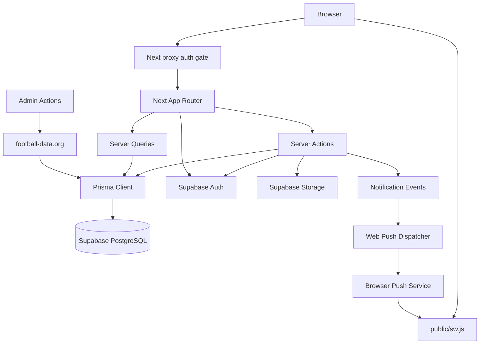
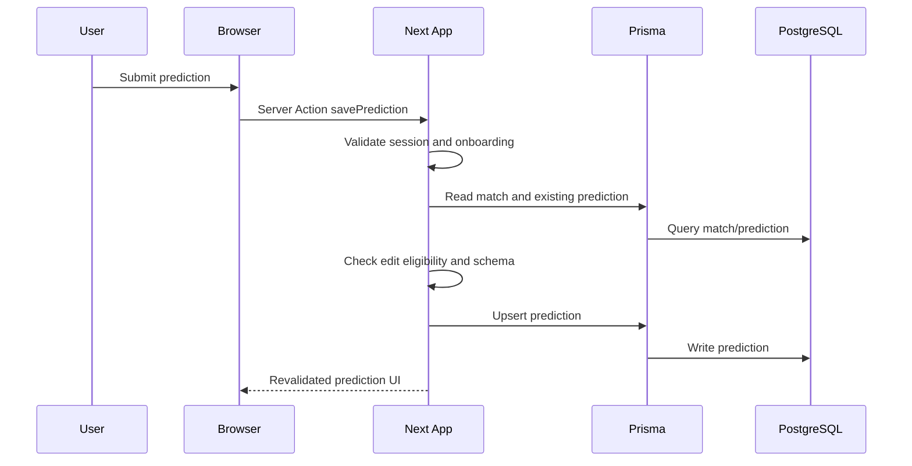

# System Architecture

## System Overview

The repository is a single Next.js 16 App Router application written in TypeScript. It uses Server Components for read-heavy pages, Server Actions for mutations, Prisma 7 for privileged PostgreSQL access, Supabase for auth and storage, Content Collections for MDX rules, and Web Push with VAPID for browser notifications.

## Architecture Diagram

Text alternative: browser requests pass through the Next proxy, then route handlers, Server Components, or Server Actions. Reads and writes go through Prisma to Supabase PostgreSQL. Auth operations use Supabase clients. Admin sync pulls football-data.org data into PostgreSQL. Notification-producing actions write outbox rows; the dispatcher sends encrypted Web Push payloads to browser push services, which wake the service worker.

## Component Descriptions

### `src/app`

- **Purpose**: Route tree and page composition.
- **Responsibilities**: Public landing, auth routes, protected app shell, pools, matches, rankings, settings, admin pages, API route handlers.
- **Dependencies**: Feature queries/actions/components, i18n, layout providers, Supabase clients.
- **Type**: Application.

### `src/features/auth`

- **Purpose**: Authentication and account lifecycle.
- **Responsibilities**: Sign-in/up, OAuth callback helper, MFA enroll/verify/disable, passkey login/management, password/email change, account deletion, auth schemas.
- **Dependencies**: Supabase SSR/client/admin, Prisma, zod, react-hook-form in UI.
- **Type**: Application feature.

### `src/features/profile`

- **Purpose**: User profile and onboarding.
- **Responsibilities**: Profile reads, nickname assignment, avatar uploads/defaults/Google photo, onboarding completion, locale updates.
- **Dependencies**: Prisma, Supabase Storage, Supabase auth user, i18n.
- **Type**: Application feature.

### `src/features/competition`

- **Purpose**: World Cup fixture and provider sync.
- **Responsibilities**: Static seed, match/team queries, football-data.org provider adapter, status mapping, sync orchestration, cache tags.
- **Dependencies**: Prisma, football-data.org HTTP API, Next cache tags.
- **Type**: Application feature plus external integration.

### `src/features/predictions`

- **Purpose**: Prediction workflows.
- **Responsibilities**: Fixture-by-day view, prediction form, eligibility, validation, save action, lock logic.
- **Dependencies**: Prisma, competition queries, scoring score resolution.
- **Type**: Application feature.

### `src/features/pools`

- **Purpose**: Public/private league management.
- **Responsibilities**: Pool listing/detail, create/join/leave/kick/delete, directed invites, invite tokens, membership session helpers.
- **Dependencies**: Prisma, profile onboarding gate, notifications for directed invite events.
- **Type**: Application feature.

### `src/features/scoring` and `src/features/scoring-rankings`

- **Purpose**: Deterministic scoring and leaderboards.
- **Responsibilities**: Pure score computation, persisted scoring adapter, score sweeper, dense ranking, global and pool ranking queries.
- **Dependencies**: Prisma, Next cache, competition result data.
- **Type**: Domain services.

### `src/features/notifications`

- **Purpose**: Web Push notification subsystem.
- **Responsibilities**: Preference UI, save/deactivate push subscriptions, queue event outbox rows, emit match/ranking/invite events, dispatch via `web-push`.
- **Dependencies**: Prisma, `web-push`, VAPID env vars, `public/sw.js`, browser Push API.
- **Type**: Application feature plus external integration.

### `src/features/admin`

- **Purpose**: Operational admin dashboard.
- **Responsibilities**: Admin authorization, sync trigger, forced results, revert override, status panels, result view revalidation.
- **Dependencies**: Prisma, competition sync services, scoring, notifications, Next cache invalidation.
- **Type**: Application feature.

### `src/lib`

- **Purpose**: Shared infrastructure utilities.
- **Responsibilities**: Prisma singleton, Supabase browser/server/admin clients, auth user cache, safe redirects, locale and date helpers, brand theme helpers.
- **Dependencies**: Prisma, Supabase SSR/client, React cache, Next headers/cookies.
- **Type**: Shared package.

### `prisma`

- **Purpose**: Database model and versioned migrations.
- **Responsibilities**: Prisma schema, migration history, generated client target, seed entrypoint.
- **Dependencies**: PostgreSQL 18 on Supabase, Prisma 7.
- **Type**: Model/infrastructure package.

## Data Flow

## Integration Points

- **External APIs**: football-data.org for competition teams, fixtures, live status, and results.
- **Databases**: Supabase PostgreSQL accessed via Prisma using the `pg` adapter.
- **Third-party Services**: Supabase Auth, Supabase Storage, browser push services, Resend through Supabase SMTP configuration for auth email templates.
- **Client Platform APIs**: Service Worker API, Push API, Notification API, WebAuthn through Supabase native passkeys.

## Infrastructure Components

- **CDK Stacks**: None found.
- **Terraform**: None found.
- **CloudFormation**: None found.
- **Deployment Model**: Next.js app intended for Vercel with Supabase-managed PostgreSQL/Auth/Storage. `docker-compose.yml` supports local Postgres-oriented development/test flows.
- **Networking**: No application-managed VPC/subnet/security-group definitions in the repository. Database connection settings are controlled by env vars such as `DATABASE_URL` and `DB_CONNECTION_LIMIT`.
