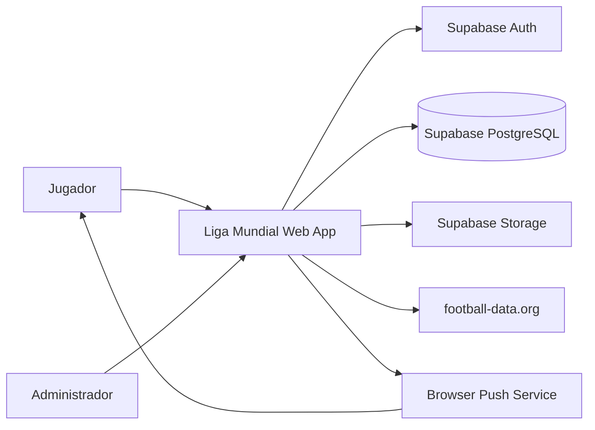

# Business Overview

## Business Context Diagram

Text alternative: players and administrators use the Next.js app. The app delegates authentication to Supabase Auth, stores product data in Supabase PostgreSQL through Prisma, stores avatar assets in Supabase Storage, imports match data from football-data.org, and sends Web Push messages through browser push services.

## Business Description

- **Business Description**: Liga Mundial is a prediction league SaaS for FIFA World Cup 2026. Users register, complete onboarding, join public or private pools, predict match scores, receive deterministic points, and compare rankings globally or inside pools.
- **Business Transactions**: User registration and account access; profile onboarding; pool creation/discovery/invites/membership; fixture browsing and prediction submission; competition sync and admin overrides; score calculation and rankings; notification preference/device registration and Web Push dispatch; rules education.

## Business Dictionary

- **Profile**: Public app identity linked by UUID to a Supabase Auth user.
- **Pool**: A public or private prediction league, capped by capacity.
- **Prediction**: A user's expected score for one match, optionally including a penalty winner for knockout draws.
- **PredictionScore**: Persisted deterministic score breakdown for a prediction after the match result is available.
- **ProviderSyncRun**: Audit record for a football-data.org sync attempt.
- **NotificationEvent**: Durable outbox row representing a push notification to one recipient.
- **PushSubscription**: Browser endpoint and encryption keys used for Web Push delivery.

## Component Level Business Descriptions

### Auth

- **Purpose**: Controls account creation, login, MFA/passkeys, email flows, and account deletion.
- **Responsibilities**: Supabase session operations, secure redirects, throttled email actions, profile verification sync, and destructive account purge through Supabase Admin API.

### Profile

- **Purpose**: Builds the public identity required before gameplay.
- **Responsibilities**: Onboarding, nickname validation, avatar source selection/upload, locale persistence, and profile self-healing when the auth trigger did not create a row.

### Competition

- **Purpose**: Maintains World Cup 2026 teams, phases, matches, provider sync state, and fixture cache invalidation.
- **Responsibilities**: Seed data, football-data.org normalization, DB upserts, sync runs, match status mapping, and stale fixture notices.

### Predictions

- **Purpose**: Lets users submit and review predictions for matches.
- **Responsibilities**: Eligibility, locking, validation, per-user fixture enrichment, and UI controls for score and penalty winner entry.

### Pools

- **Purpose**: Provides the league/group layer for social competition.
- **Responsibilities**: Pool CRUD actions, membership rules, invite tokens, directed invites, public directory, and membership authorization.

### Scoring And Rankings

- **Purpose**: Converts predictions and results into points and leaderboards.
- **Responsibilities**: Pure scoring rules, persisted score rows, dense ranking, global ranking, pool leaderboard cache, and result-view invalidation.

### Notifications

- **Purpose**: Delivers opt-in browser notifications for match and ranking events.
- **Responsibilities**: Preferences, browser subscription storage, outbox event queueing, VAPID Web Push dispatch, delivery auditing, and dead subscription deactivation.

### Admin

- **Purpose**: Gives administrators operational control over competition data.
- **Responsibilities**: Trigger sync, inspect recent runs, force/revert results, enforce admin access, and revalidate views after result mutations.

### Education

- **Purpose**: Explains rules and scoring behavior to users.
- **Responsibilities**: MDX rule pages, landing content, scoring calculator, contextual hints, and breakdown explainers.
