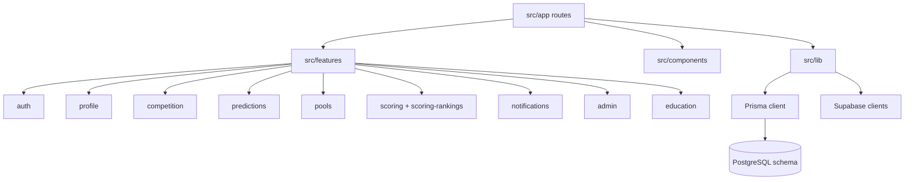

# Code Structure

## Build System

- **Type**: pnpm workspace with Next.js scripts.
- **Configuration**: `package.json`, `pnpm-workspace.yaml`, `next.config.ts`, `tsconfig.json`, `eslint.config.mjs`, `biome.json`, `vitest.config.ts`, `postcss.config.mjs`, `content-collections.ts`, `prisma.config.ts`.
- **Primary Commands**: `pnpm dev`, `pnpm build`, `pnpm test`, `pnpm lint`, `pnpm check`, `pnpm prisma:generate`, `pnpm prisma:migrate`.

## Module Hierarchy

Text alternative: route files compose shared UI and feature modules. Feature modules own actions, queries, services, schemas, components, types, and tests. Shared infrastructure lives in `src/lib`. Prisma schema and migrations define the data model.

## Existing Files Inventory

- `src/app/layout.tsx` - Root layout, global providers, theme/brand setup.
- `src/app/page.tsx` - Public landing page.
- `src/app/(auth)/*` - Auth pages for sign-in, sign-up, password recovery, email verification, and reset.
- `src/app/auth/callback/route.ts` - Supabase OAuth/PKCE callback route.
- `src/app/auth/confirm/route.ts` - Token hash confirmation route.
- `src/app/(app)/layout.tsx` - Protected app shell layout and onboarding guard.
- `src/app/(app)/matches/page.tsx` - Match fixture and prediction entry page.
- `src/app/(app)/pools/**` - Pool list, create, discover, detail, join, and leaderboard pages.
- `src/app/(app)/rankings/page.tsx` - Global ranking page.
- `src/app/(app)/settings/**` - Profile and security settings pages.
- `src/app/(app)/admin/**` - Admin dashboard and match operations pages.
- `src/app/api/notifications/dispatch/route.ts` - Protected notification dispatcher endpoint.
- `src/app/api/csp-report/route.ts` - CSP report intake endpoint.
- `src/proxy.ts` - Next proxy middleware for session, email verification, onboarding, and auth-only route gates.
- `src/features/**` - Feature modules for auth, profile, competition, predictions, pools, scoring, rankings, notifications, admin, and education.
- `src/components/**` - Shared UI, layout, theme, language, and provider components.
- `src/i18n/**` - Typed Spanish/English dictionaries and locale helpers.
- `src/lib/**` - Prisma, Supabase clients, safe redirects, formatting, locale, brand theme, and auth logging helpers.
- `prisma/schema.prisma` - Domain schema, enums, relationships, indexes.
- `prisma/migrations/**/migration.sql` - Versioned database migrations, including RLS/triggers and auth access token hook.
- `public/sw.js` - Web Push service worker.
- `public/flags/*.svg` - Team flag assets.
- `public/avatars/*.svg` - Bundled fallback avatars.
- `scripts/*` - Seed, flag sync/check, admin promotion, and MCP config generation scripts.

## Design Patterns

- **Feature-Based Modules**: `src/features/<feature>/` keeps domain behavior close to actions, queries, schemas, UI, and tests.
- **Server Actions For Mutations**: `src/features/*/actions/*.ts` centralize authorization, validation, DB writes, and revalidation.
- **Server Components For Reads**: `src/app/**/page.tsx` and layouts fetch data on the server and pass serializable props to client islands.
- **Durable Outbox For Push Notifications**: Notification producers upsert `NotificationEvent` rows; dispatcher sends later and records delivery status.
- **Provider Adapter For Competition Sync**: Provider services normalize external data before persistence.
- **Cache Tags And Revalidation**: `unstable_cache`, tags, `revalidatePath`, `revalidateTag`, and `updateTag` are used for fixture/ranking freshness.

## Critical Dependencies

- **Next.js `^16.2.7`**: App Router, Server Components, Server Actions, route handlers, proxy middleware, cache tags.
- **React `^19.2.7`**: UI rendering, `cache`, transitions, action state.
- **Prisma `^7.8.0`**: PostgreSQL schema, migrations, typed database client.
- **Supabase**: Auth, sessions, OAuth, MFA, passkeys, admin delete user, storage.
- **web-push `^3.6.7`**: VAPID-authenticated encrypted Web Push delivery.
- **Tailwind CSS `^4.3.0`**: CSS-first styling through `src/app/globals.css` and utility classes.
- **zod and react-hook-form**: Type-safe user input handling.
