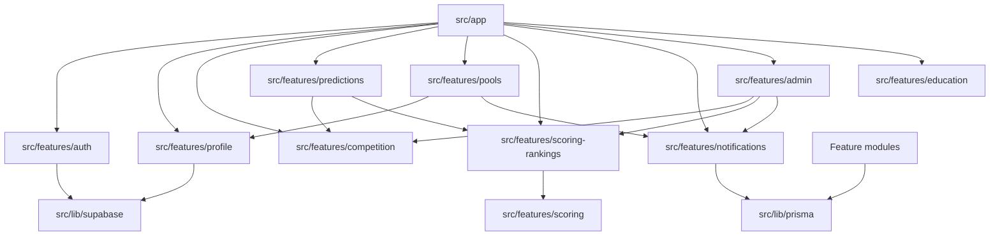

# Dependencies

## Internal Dependencies

Text alternative: `src/app` composes all features. Prediction and ranking features depend on competition data. Pool and admin mutations can emit notification events. Auth/profile depend on Supabase clients. Most feature modules depend on Prisma for persistence.

## Internal Dependency Notes

- **`src/app` depends on feature modules**: route files call feature queries and compose feature components/actions.
- **`predictions` depends on `competition` and `scoring-rankings`**: prediction pages enrich cached fixture matches with user predictions and persisted score resolution.
- **`admin` depends on `competition`, `scoring-rankings`, and `notifications`**: sync and override actions mutate match data, trigger scoring/revalidation, and queue match notifications.
- **`pools` depends on `profile` and `notifications`**: mutations require onboarded users and directed invites can queue push events.
- **`notifications` depends on Prisma and public service worker**: server stores subscriptions/events/deliveries; browser receives payloads through `public/sw.js`.
- **`auth` and `profile` depend on Supabase clients**: auth/session/passkey/MFA/storage operations are delegated to Supabase.

## External Dependencies

- **`next` `^16.2.7`** - Full-stack app framework. License: MIT.
- **`react` and `react-dom` `^19.2.7`** - UI rendering and RSC support. License: MIT.
- **`@prisma/client`, `prisma`, `@prisma/adapter-pg` `^7.8.0`** - ORM, generated client, migrations, PostgreSQL adapter. License: Apache-2.0.
- **`@supabase/ssr`, `@supabase/supabase-js` `^0.12.0` / `^2.108.1`** - Supabase auth/storage clients and SSR cookie integration. License: MIT.
- **`web-push` `^3.6.7`** - VAPID Web Push encryption and delivery. License: MIT.
- **`zod` `^4.4.3`** - Runtime validation. License: MIT.
- **`react-hook-form` and `@hookform/resolvers` `^7.78.0` / `^5.4.0`** - Form state and schema resolver integration. License: MIT.
- **`tailwindcss` and `@tailwindcss/postcss` `^4.3.0`** - CSS-first utility styling. License: MIT.
- **`@base-ui/react` `^1.5.0`** - Accessible headless UI primitives. License: MIT.
- **`lucide-react` `^1.17.0`** - Icon set. License: ISC.
- **`sonner` `^2.0.7`** - Toast UI. License: MIT.
- **`next-themes` `^0.4.6`** - Theme switching support. License: MIT.
- **Content Collections packages** - MDX rules content ingestion. License: MIT.
- **Tooling dependencies** - Biome, ESLint, Vitest, Playwright, TypeScript, tsx, Lefthook. License: varies by package; formal scan not executed.

## Environment Dependencies

- `DATABASE_URL` - PostgreSQL connection string, typically Supabase pooler/direct depending on operation.
- `DB_CONNECTION_LIMIT` - Prisma/pg connection limit, defaulted by app code when absent.
- `NEXT_PUBLIC_SUPABASE_URL` and `NEXT_PUBLIC_SUPABASE_ANON_KEY` - Public Supabase client configuration.
- `SUPABASE_SERVICE_ROLE_KEY` - Admin operations such as auth user deletion and privileged storage actions.
- `FOOTBALL_DATA_KEY` - football-data.org API access.
- `NEXT_PUBLIC_VAPID_PUBLIC_KEY`, `VAPID_PRIVATE_KEY`, `VAPID_SUBJECT` - Web Push VAPID setup.
- `SYNC_TRIGGER_SECRET` - Optional protection for notification dispatch/sync trigger endpoints.
