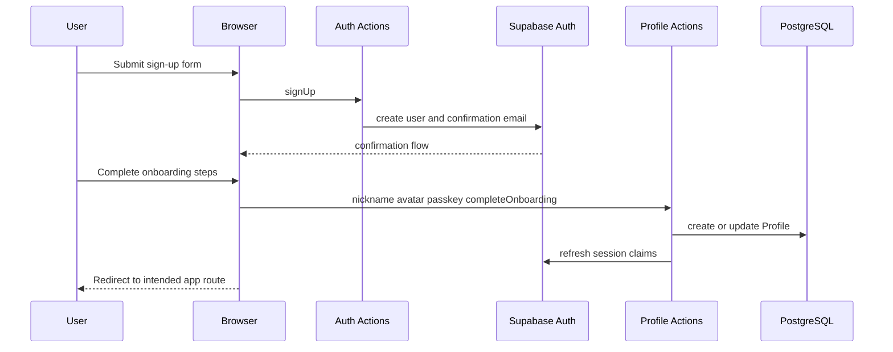
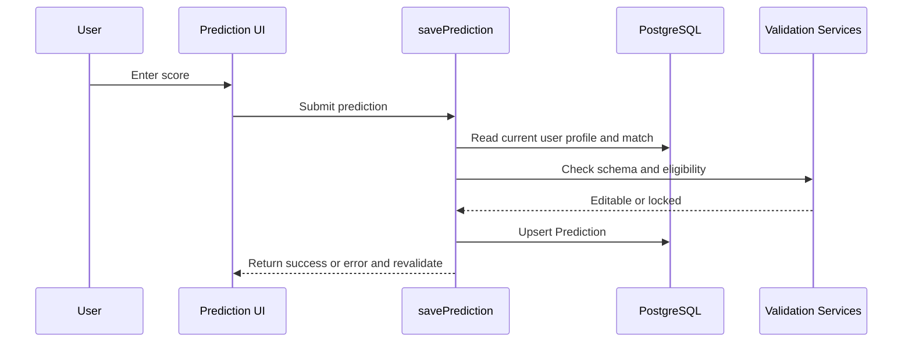
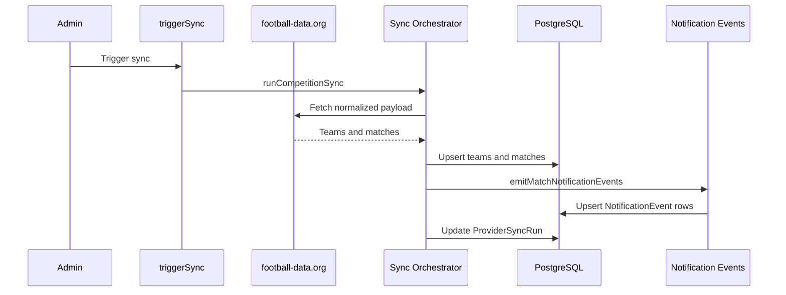
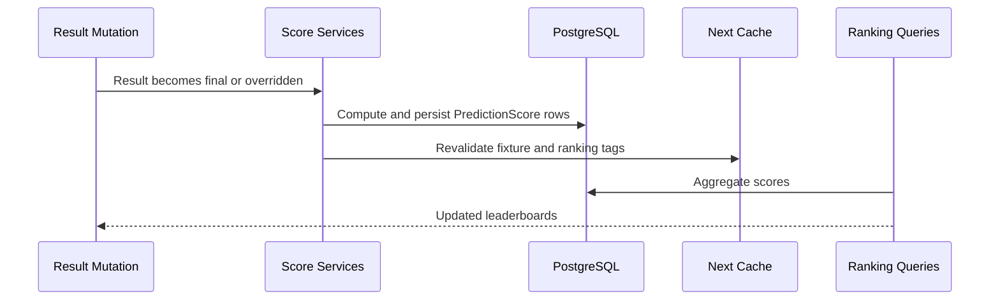
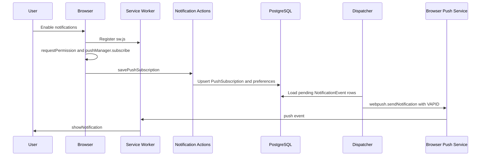
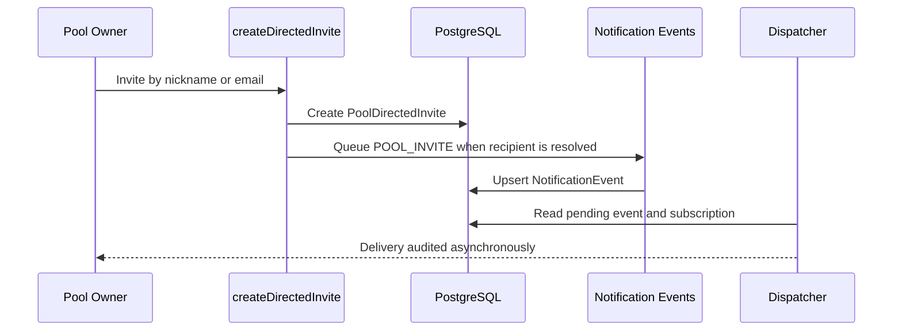

# Interaction Diagrams

## User Sign-Up And Onboarding

Text alternative: account creation happens in Supabase Auth; product identity is completed through profile actions in PostgreSQL. Completing onboarding refreshes the session so proxy claims unlock protected routes.

## Prediction Submission

## Competition Sync And Notification Events

## Result Scoring And Rankings

## Web Push Notifications

## Directed Pool Invite With Push

Text alternative: directed invites that resolve to a user can queue a push event. General invite links/tokens remain shareable but do not identify a push recipient by themselves.
